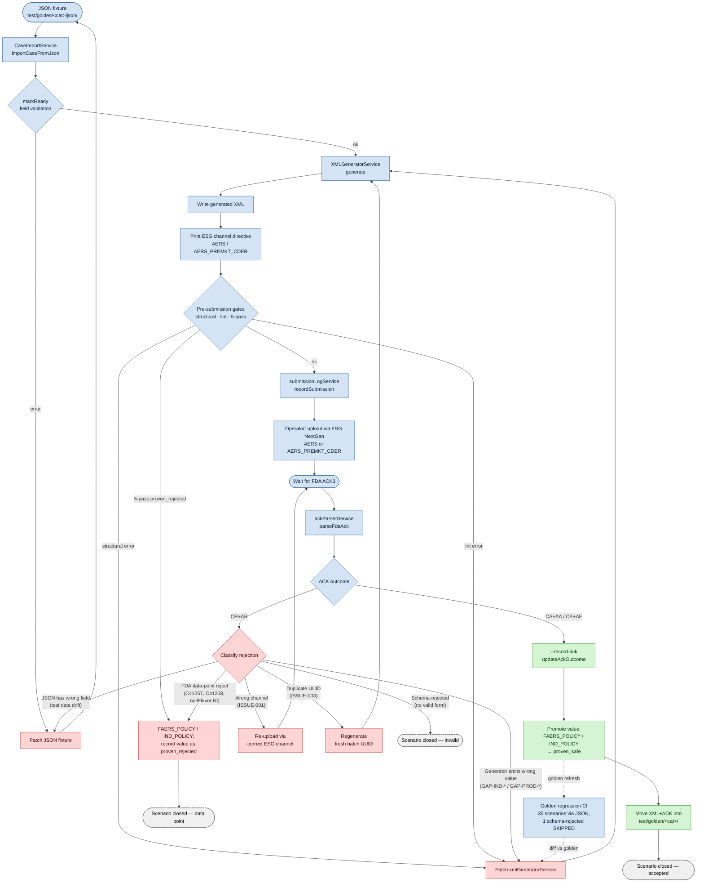

# FAERS Submission Flow — Single Diagram

**Purpose:** One mermaid `flowchart` covering the **complete submission lifecycle** — from JSON fixture through FDA ACK3 through retry cycles back to the generator — without splitting v1 / v2 / v3 cycles into separate diagrams. Rejection branches are drawn as back-edges so the visual stays connected.

Companion docs:
- [`test/test_submission/SUBMISSION_CAMPAIGN_REPORT.md`](../../test/test_submission/SUBMISSION_CAMPAIGN_REPORT.md) — campaign-level inventory + run history
- [`test/test_submission/ACK_Issue_Tracker.md`](../../test/test_submission/ACK_Issue_Tracker.md) — every ACK with its disposition
- [`docs/status/2026-05-09_regression_verified_green.md`](../status/2026-05-09_regression_verified_green.md) — current regression state

---

## Flow

---

## Cycle inventory

The diagram contains four distinct cycles. They share the same `GEN` / `JSON` nodes so the picture stays unified.

| # | Cycle | Trigger | Cycle back-edge |
|---|---|---|---|
| 1 | **Gate-fail loop** (pre-portal) | Structural / lint / 5-pass error from local gates | `PATCH_GEN → GEN` (re-emit) |
| 2 | **Generator-gap loop** (post-ACK) | CR+AR with patchable generator cause (e.g. GAP-IND-001..007, GAP-PROD-001/002) | `PATCH_GEN → GEN` (regenerate, fresh UUID, upload again) |
| 3 | **JSON-drift loop** (pre-portal or post-ACK) | markReady error, or post-ACK CR+AR caused by JSON field mismatch | `PATCH_JSON → JSON` |
| 4 | **Channel mismatch loop** (ISSUE-001) | Right XML, wrong portal channel | `REUP → WAIT` (no regen needed — FDA hasn't registered the UUID) |

The two dashed audit edges (`POLICY ⇢ REGRESS ⇢ PATCH_GEN`) represent the CI feedback loop: every promoted golden re-enters the regression suite, and any regression failure triggers a generator patch — closing the system over its own outputs.

## Terminal states

| Node | Meaning |
|---|---|
| `DONE` | CA+AA / CA+AE round-trip complete; value promoted to `proven_safe`; XML+ACK in `test/golden/` |
| `DONE_REJ` | FDA rejected the field value; value recorded as `proven_rejected` in policy; no further submission planned (e.g. TC-A03 race C41257, TC-A04 race C41258) |
| `CLOSED_REJ` | Scenario has no valid XML form under CDER 2.18 (e.g. TC-A06 ethnicity `nullFlavor="NI"` triggers SAX schema error); permanently skipped |

## Where this fits in the codebase

| Diagram node | Implementation |
|---|---|
| `IMPORT` / `READY` | `faers-app/src/main/services/caseImportService.ts`, `validationService.ts` |
| `GEN` / `WRITE` / `ROUTE` | `faers-app/src/main/services/xmlGeneratorService.ts`, `faers-app/src/main/headless/cli.ts` |
| `GATES` | `xmlLintService.ts`, `fivePassValidatorService.ts` + the `faers_xml_lint.py` 60-check |
| `LOG` | `faers-app/src/main/services/submissionLogService.ts` |
| `UPLOAD` | External (ESG NextGen portal / API via `test/test_submission/submit_batch.py`) |
| `ACK_PARSE` | `faers-app/src/main/services/ackParserService.ts` |
| `POLICY` | `faers-app/src/main/services/faersEmpiricalPolicy.ts` (FAERS_POLICY + IND_POLICY) |
| `GOLD` | `test/golden/<category>/{xml,json}/`, `test/golden/manifest.json` |
| `REGRESS` | `test/test_submission/golden_regression_test.py` + `.github/workflows/regression.yml` |
| `PATCH_GEN` / `PATCH_JSON` | Whatever PR closes the gap. Tracked in `docs/gaps/GAP-*.md`. |
