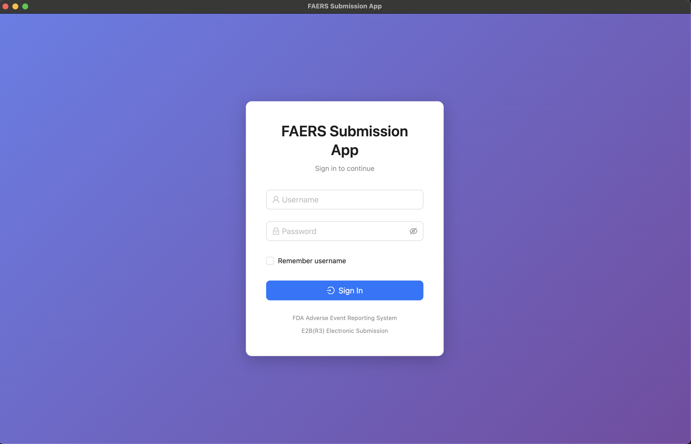
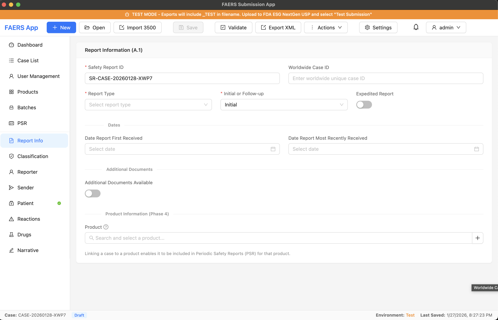
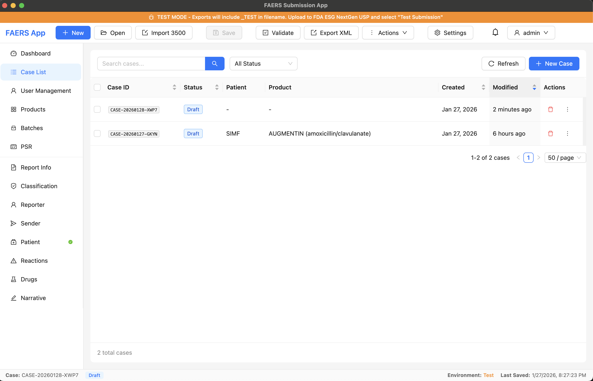
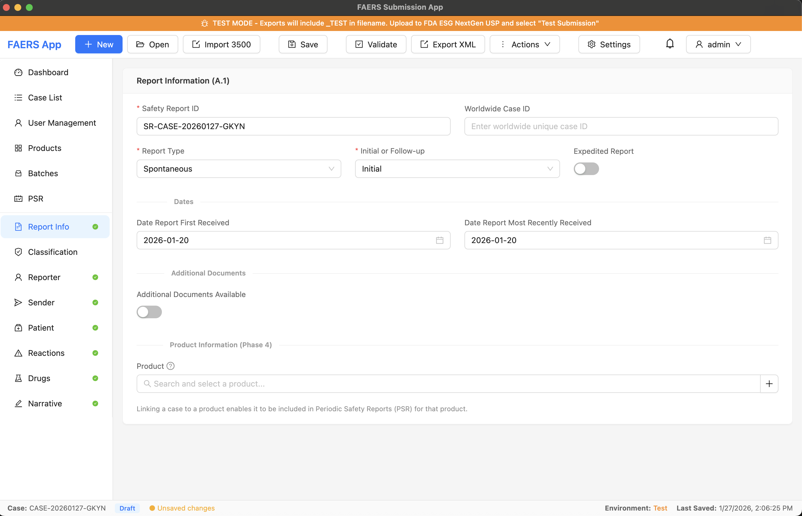
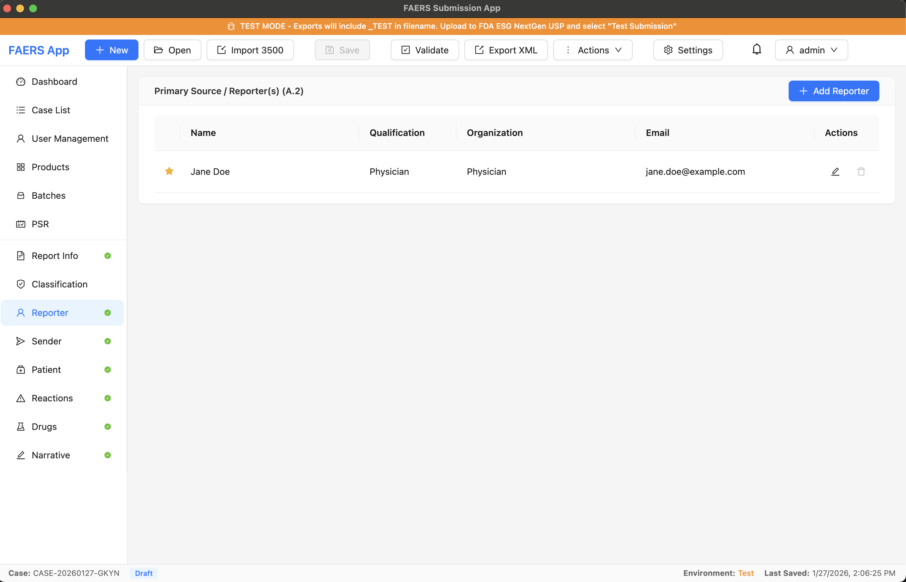
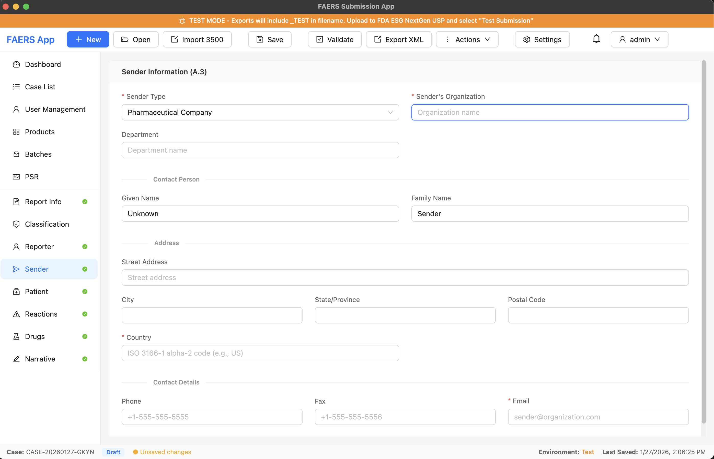
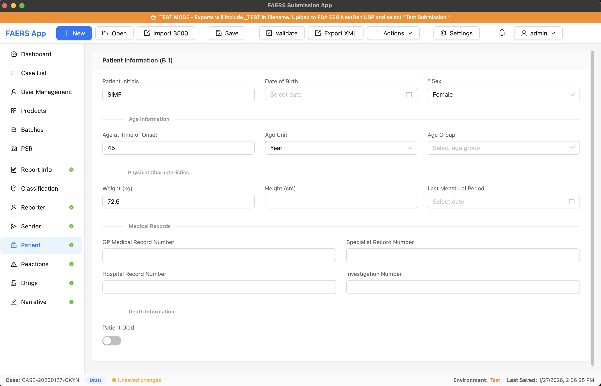
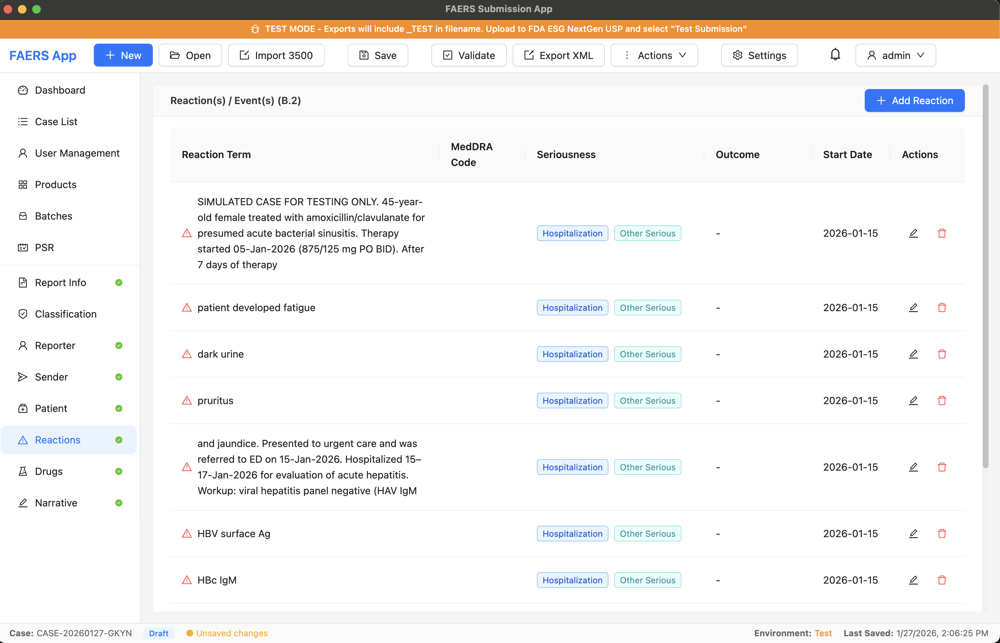
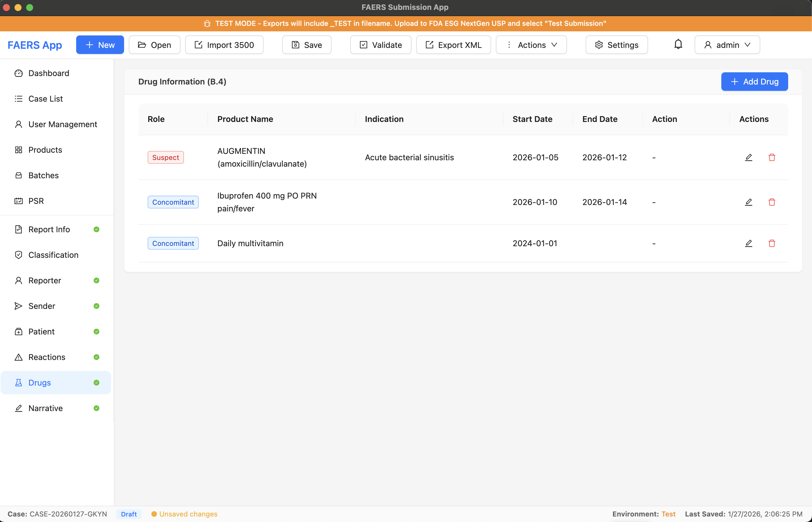
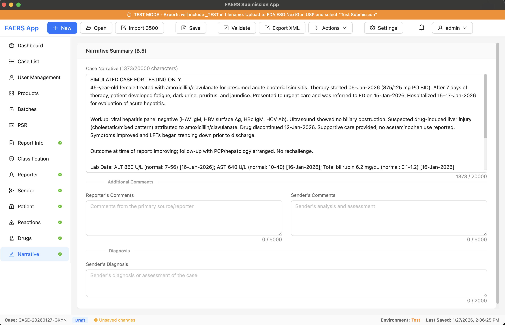

# FAERS Submission Application - User Guide

**Version:** 5.0
**Applies to:** Phase 5 (Enhanced Data Management) + Phase 2B (ESG NextGen API)
**Last Updated:** January 2026

---

## Table of Contents

1. [Introduction](#1-introduction)
2. [Getting Started](#2-getting-started)
3. [Logging In](#3-logging-in)
4. [Application Overview](#4-application-overview)
5. [Working with Cases](#5-working-with-cases)
6. [Workflow Management](#6-workflow-management)
7. [Comments and Notes](#7-comments-and-notes)
8. [Data Entry Guide](#8-data-entry-guide)
9. [Validation](#9-validation)
10. [Exporting XML](#10-exporting-xml)
11. [FDA API Submission (Phase 2B)](#11-fda-api-submission-phase-2b)
12. [Notifications](#12-notifications)
13. [Audit Trail](#13-audit-trail)
14. [User Management (Administrators)](#14-user-management-administrators)
15. [Data Management](#15-data-management)
16. [User Account Management](#16-user-account-management)
17. [Report Type Classification](#17-report-type-classification)
18. [Product Management](#18-product-management)
19. [Follow-Up and Nullification Reports](#19-follow-up-and-nullification-reports)
20. [Batch Submission](#20-batch-submission)
21. [Periodic Safety Reports (PSR)](#21-periodic-safety-reports-psr)
22. [MedDRA Coding](#22-meddra-coding)
23. [WHO Drug Coding](#23-who-drug-coding)
24. [Advanced Search](#24-advanced-search)
25. [Duplicate Detection](#25-duplicate-detection)
26. [Case Templates](#26-case-templates)
27. [Bulk Import](#27-bulk-import)
28. [Validation Rules](#28-validation-rules)
29. [Keyboard Shortcuts](#29-keyboard-shortcuts)
30. [Troubleshooting](#30-troubleshooting)
31. [Glossary](#31-glossary)

---

## 1. Introduction

### 1.1 Purpose

The FAERS Submission Application is a desktop tool designed to help pharmaceutical and biotech companies create, manage, and export Individual Case Safety Reports (ICSRs) for submission to the FDA's Adverse Event Reporting System (FAERS).

### 1.2 Who Should Use This Application

- **Safety Officers** responsible for adverse event reporting
- **Pharmacovigilance Specialists** managing drug safety data
- **Regulatory Affairs Professionals** preparing FDA submissions
- **Clinical Safety Associates** documenting adverse events
- **Medical Reviewers** reviewing and approving cases
- **QC Reviewers** performing quality control
- **Administrators** managing users and system configuration

### 1.3 What This Application Does

- Creates structured ICSR cases following FDA E2B(R3) requirements
- Captures all required adverse event information
- Validates data before submission
- Generates compliant E2B(R3) XML files for FDA submission
- Stores cases locally for ongoing management
- **Supports multi-user authentication and access control**
- **Tracks audit history for 21 CFR Part 11 compliance**

### 1.4 Regulatory Context

The FDA requires pharmaceutical companies to report adverse events electronically using the E2B(R3) standard. Key reporting timelines include:

| Report Type                                       | Timeline                      |
| ------------------------------------------------- | ----------------------------- |
| **Expedited Reports** (serious, unexpected) | 15 calendar days              |
| **Non-Expedited Reports**                   | Periodic (quarterly/annually) |

---

## 2. Getting Started

### 2.1 System Requirements

| Component        | Requirement                              |
| ---------------- | ---------------------------------------- |
| Operating System | Windows 10+, macOS 11+, or Ubuntu 20.04+ |
| Display          | Minimum 1280 x 720 resolution            |
| Storage          | 500 MB available space                   |
| Memory           | 4 GB RAM minimum                         |

### 2.2 Installation

1. Download the installer for your operating system
2. Run the installer and follow the on-screen prompts
3. Launch the application from your Start Menu (Windows), Applications folder (macOS), or application menu (Linux)

### 2.3 First Launch

When you first launch the application:

1. The database will be automatically initialized
2. A default administrator account is created (see Section 3.2)
3. You'll see the login screen
4. Log in with your credentials to access the application

### 2.4 Data Storage Location

Your data is stored locally in:

| Platform | Location                                            |
| -------- | --------------------------------------------------- |
| Windows  | `%APPDATA%\FAERSApp\faers.db`                     |
| macOS    | `~/Library/Application Support/FAERSApp/faers.db` |
| Linux    | `~/.config/FAERSApp/faers.db`                     |

---

## 3. Logging In

### 3.1 Login Screen

When you start the application, you'll see the login screen:

<!-- SCREENSHOT: login-screen.png - Application login screen with username and password fields -->


*Figure 3.1: Login Screen*

The login screen includes:

- Username field
- Password field (masked)
- "Remember username" checkbox
- Sign In button

### 3.2 Default Administrator Account

On first launch, a default administrator account is created:

| Field              | Value            |
| ------------------ | ---------------- |
| **Username** | `admin`        |
| **Password** | `Admin@123456` |

**Important**: Change this password immediately after first login!

### 3.3 Logging In

1. Enter your username
2. Enter your password
3. Optionally check "Remember username" to save your username for next time
4. Click **Sign In**

### 3.4 Failed Login Attempts

For security, accounts are locked after 5 failed login attempts:

- You'll see a message indicating how many attempts remain
- After 5 failures, the account is locked for 30 minutes
- Contact your administrator if you need immediate access

### 3.5 First-Time Password Change

If your password was set by an administrator or has expired, you'll be required to change it before accessing the application:

1. Enter your current password
2. Enter a new password meeting the policy requirements
3. Confirm your new password
4. Click **Change Password**

### 3.6 Password Requirements

Passwords must meet the following requirements:

- At least 12 characters long
- Contains at least one uppercase letter (A-Z)
- Contains at least one lowercase letter (a-z)
- Contains at least one number (0-9)
- Contains at least one special character (!@#$%^&*)
- Cannot reuse the last 5 passwords

### 3.7 Session Timeout

For security, your session will expire after 30 minutes of inactivity:

- A warning dialog appears 5 minutes before timeout
- Click **Continue Session** to extend your session
- If you don't respond, you'll be automatically logged out
- Your unsaved work is preserved - log back in to continue

### 3.8 Logging Out

To log out:

1. Click your username in the toolbar (top right)
2. Select **Logout** from the dropdown menu

---

## 4. Application Overview

### 4.1 Main Window Layout

<!-- SCREENSHOT: main-window.png - Main application window showing toolbar, navigation sidebar, and content area --


*Figure 4.1: Main Application Window*

The main window consists of three main areas:

1. **Toolbar** (top) - Contains buttons for common actions (New, Open, Save, Validate, Export, Settings) and the user menu
2. **Navigation Sidebar** (left) - Provides navigation to main views (Dashboard, Case List) and case form sections when a case is open
3. **Main Content Area** (center) - Displays the current view (Dashboard, Case List, or case form sections)
4. **Status Bar** (bottom) - Shows current case ID, status, environment, and last saved timestamp

### 4.2 Toolbar Buttons

| Button                | Description                             |
| --------------------- | --------------------------------------- |
| **New**         | Create a new ICSR case                  |
| **Open**        | Return to the case list                 |
| **Import 3500** | Import a Form 3500A PDF                 |
| **Save**        | Save the current case                   |
| **Validate**    | Check the case for errors               |
| **Export XML**  | Generate E2B(R3) XML file               |
| **Settings**    | Open application settings               |
| **User Menu**   | Access profile, change password, logout |

### 4.3 User Menu

Click your username in the top-right corner to access:

| Option                    | Description                 |
| ------------------------- | --------------------------- |
| **Profile**         | Displays your name          |
| **Change Password** | Open password change dialog |
| **Logout**          | Sign out of the application |

### 4.4 Navigation Panel

The left sidebar provides navigation between:

**Main Views:**

- **Dashboard** - Overview of cases and submission status
- **My Cases** - Cases assigned to you (default landing page)
- **Case List** - View and manage all cases
- **Notifications** - View alerts and updates
- **Audit Log** - System audit trail (Administrators/Managers only)
- **User Management** - Manage users and roles (Administrators only)

**Case Form Sections** (when a case is open):

- **Report** - Report identification and type
- **Reporter** - Primary source/reporter information
- **Sender** - Your organization's information
- **Patient** - Patient demographics and history
- **Reactions** - Adverse events/reactions
- **Drugs** - Suspect and concomitant medications
- **Narrative** - Case summary
- **Comments** - Workflow comments and discussions
- **Notes** - Personal and team notes

### 4.5 Status Bar

The bottom status bar shows:

- Current Case ID
- Case Status (Draft, Ready, Exported, Submitted, Acknowledged)
- Environment indicator (Test or Production)
- Last saved timestamp

---

## 5. Working with Cases

### 5.1 Creating a New Case

<!-- SCREENSHOT: new-case-button.png - Toolbar showing the New Case button highlighted -->



*Figure 5.1: Creating a New Case from Toolbar*

**Method 1: Toolbar**

1. Click the **New** button in the toolbar
2. A new case is created with a unique ID (format: `CASE-YYYYMMDD-XXXX`)
3. The case opens in the Report section

**Method 2: Menu**

1. Go to **File > New Case** or press `Ctrl+N` (Windows/Linux) or `Cmd+N` (macOS)

**Method 3: Case List**

1. Navigate to the Case List
2. Click the **New Case** button

### 5.2 Opening an Existing Case

<!-- SCREENSHOT: case-list.png - Case list view showing cases with columns for ID, status, patient, receipt date -->



*Figure 5.2: Case List View*

1. Navigate to the **Case List** (click "Open" in toolbar or select "Case List" in sidebar)
2. Find your case using:
   - **Search box**: Search by Case ID or patient initials
   - **Status filter**: Filter by Draft, Ready, or Exported
   - **Column sorting**: Click column headers to sort
3. **Double-click** the case to open it, or right-click and select "Open"

### 5.3 Saving a Case

Cases can be saved at any time, even with incomplete data:

- Click **Save** in the toolbar
- Press `Ctrl+S` (Windows/Linux) or `Cmd+S` (macOS)
- The status bar shows "Last Saved" timestamp when successful

**Auto-Save**: The application automatically saves your work every 5 minutes.

**Unsaved Changes**: A yellow dot (●) in the status bar indicates unsaved changes.

### 5.4 Case Workflow Status

Cases progress through a defined workflow with these statuses:

| Status                            | Description                                                  |
| --------------------------------- | ------------------------------------------------------------ |
| **Draft**                   | Case is being created/edited by Data Entry.                  |
| **Data Entry Complete**     | Data entry finished, ready for medical review.               |
| **In Medical Review**       | Assigned to Medical Reviewer for clinical assessment.        |
| **Medical Review Complete** | Medical review finished, ready for QC.                       |
| **In QC Review**            | Assigned to QC Reviewer for quality check.                   |
| **QC Complete**             | QC review finished, ready for final approval.                |
| **Approved**                | Case approved for submission to FDA.                         |
| **Submitted**               | Case has been submitted to FDA via ESG NextGen USP.          |
| **Acknowledged**            | FDA has acknowledged receipt of the submission.              |
| **Rejected**                | Returned by reviewer (requires correction and resubmission). |

**Note:** See [Section 6: Workflow Management](#6-workflow-management) for details on workflow transitions.

### 5.5 Case Submission Status

In addition to the internal workflow status, cases also have a **Submission Status** that tracks progress toward FDA submission:

| Status                  | Description                                                        |
| ----------------------- | ------------------------------------------------------------------ |
| **Draft**               | Case is being created/edited, not yet ready for export.            |
| **Ready for Export**    | Case has been validated and is ready for XML export or API submission. |
| **Exported**            | XML file has been generated for manual upload to FDA USP portal.   |
| **Submitting**          | API submission is in progress (authenticating, uploading, etc.).   |
| **Submitted**           | Case has been submitted to FDA, awaiting acknowledgment.           |
| **Submission Failed**   | API submission failed; can be retried.                             |
| **Acknowledged**        | FDA has acknowledged receipt (ACK3 received).                      |
| **Rejected**            | FDA returned a NACK; requires correction and resubmission.         |

#### Submission Status Flow

```
┌─────────────────────────────────────────────────────────────────────────────────┐
│                         CASE SUBMISSION STATUS FLOW                              │
└─────────────────────────────────────────────────────────────────────────────────┘

    ┌──────────────┐
    │    Draft     │  Case is being created or edited
    └──────┬───────┘
           │
           │  Actions > Mark Ready for Export
           │  (Validates case - errors must be fixed first)
           ▼
    ┌──────────────┐
    │   Ready for  │  Case passed validation, ready for submission
    │    Export    │
    └──────┬───────┘
           │
     ┌─────┴─────┐
     │           │
     ▼           ▼
┌─────────┐  ┌──────────────┐
│ Manual  │  │  Automatic   │
│ Export  │  │ API Submit   │
└────┬────┘  └──────┬───────┘
     │              │
     ▼              ▼
┌─────────┐  ┌──────────────┐
│Exported │  │  Submitting  │─────▶ (On failure) ─▶ Submission Failed
└────┬────┘  └──────┬───────┘                             │
     │              │                                     │
     │              │ Success                             │ Retry
     │              ▼                                     │
     │       ┌──────────────┐                             │
     └──────▶│  Submitted   │◀────────────────────────────┘
             └──────┬───────┘
                    │
              ┌─────┴─────┐
              │           │
              ▼           ▼
       ┌────────────┐  ┌──────────┐
       │Acknowledged│  │ Rejected │──▶ Return to Draft
       │  (ACK3)    │  │  (NACK)  │
       └────────────┘  └──────────┘
```

#### Mark Ready for Export Action

Before a case can be submitted to FDA (either via XML export or API), it must be marked as "Ready for Export":

1. Ensure the case passes validation (no errors, warnings are acceptable)
2. Open the case in the editor
3. Click **Actions** dropdown in the toolbar
4. Select **Mark Ready for Export**
5. If validation passes, the status changes to "Ready for Export"
6. If validation fails, you'll see the error list - fix the issues and try again

**Note:** Only cases in "Draft" status can be marked ready for export.

### 5.6 Duplicating a Case

Use duplication to create follow-up reports or similar cases:

1. In the Case List, right-click the case you want to copy
2. Select **Duplicate**
3. A new case is created with:
   - New unique Case ID
   - All data copied from the original
   - Report Type set to "Follow-up"
   - Link to the original case

### 5.6 Deleting a Case

Only **Draft** cases can be deleted:

1. In the Case List, right-click the case
2. Select **Delete**
3. Confirm the deletion in the dialog

**Note**: Deleted cases are soft-deleted and can be recovered by an administrator.

---

## 6. Workflow Management

The application implements a structured workflow to ensure cases are properly reviewed and approved before submission to the FDA.

### 6.1 Workflow Overview

The FAERS application supports two submission workflows:

1. **Manual XML Export Workflow** - Export E2B(R3) XML files for manual upload to FDA ESG NextGen USP portal
2. **Automated FDA API Submission Workflow** - Submit directly to FDA via ESG NextGen REST API

Both workflows share the same case creation and review process, but differ in the final submission step.

---

### 6.2 Complete Workflow Flowcharts

#### 6.2.1 Workflow 1: Case Creation to XML Export (Manual Submission)

This workflow is used when you want to manually upload the XML file to the FDA ESG NextGen USP portal.

```
┌─────────────────────────────────────────────────────────────────────────────────┐
│                    WORKFLOW 1: CASE CREATION TO XML EXPORT                      │
│                           (Manual FDA Submission)                               │
└─────────────────────────────────────────────────────────────────────────────────┘

    ┌──────────────┐
    │  START       │
    └──────┬───────┘
           │
           ▼
    ┌──────────────┐     ┌─────────────────────────────────────────────┐
    │ CREATE CASE  │     │ • Click "New" button in toolbar             │
    │   (Draft)    │────▶│ • Or File > New Case (Ctrl+N)               │
    └──────┬───────┘     │ • Or Import from Form 3500A PDF             │
           │             └─────────────────────────────────────────────┘
           ▼
    ┌──────────────┐     ┌─────────────────────────────────────────────┐
    │  ENTER DATA  │     │ Complete all required sections:             │
    │              │────▶│ • Report Info  • Patient  • Reactions       │
    │              │     │ • Reporter     • Drugs    • Narrative       │
    └──────┬───────┘     └─────────────────────────────────────────────┘
           │
           ▼
    ┌──────────────┐     ┌─────────────────────────────────────────────┐
    │   VALIDATE   │     │ Click "Validate" button                     │
    │    CASE      │────▶│ Fix any errors shown in validation panel    │
    └──────┬───────┘     └─────────────────────────────────────────────┘
           │
           │ No Errors
           ▼
    ┌──────────────┐     ┌─────────────────────────────────────────────┐
    │ SUBMIT FOR   │     │ Actions > Submit for Review                 │
    │   REVIEW     │────▶│ Status changes: Draft → Data Entry Complete │
    └──────┬───────┘     └─────────────────────────────────────────────┘
           │
           ▼
    ┌──────────────┐     ┌─────────────────────────────────────────────┐
    │   ASSIGN TO  │     │ Manager assigns case to Medical Reviewer    │
    │ MEDICAL      │────▶│ Actions > Assign to Medical Review          │
    │   REVIEW     │     │ Status: Data Entry Complete → In Medical    │
    └──────┬───────┘     │         Review                              │
           │             └─────────────────────────────────────────────┘
           ▼
    ┌──────────────┐
    │   MEDICAL    │
    │   REVIEWER   │
    │   DECISION   │
    └──────┬───────┘
           │
     ┌─────┴─────┐
     ▼           ▼
┌────────┐  ┌────────┐
│APPROVE │  │ REJECT │───────────┐
└────┬───┘  └────────┘           │
     │                           │
     ▼                           │
┌──────────────┐                 │
│  ASSIGN TO   │                 │
│  QC REVIEW   │                 │
└──────┬───────┘                 │
       │                         │
       ▼                         │
┌──────────────┐                 │
│ QC REVIEWER  │                 │
│   DECISION   │                 │
└──────┬───────┘                 │
       │                         │
 ┌─────┴─────┐                   │
 ▼           ▼                   │
┌────────┐  ┌────────┐           │
│APPROVE │  │ REJECT │───────────┤
└────┬───┘  └────────┘           │
     │                           │
     ▼                           │
┌──────────────┐                 │
│    FINAL     │                 │
│   APPROVAL   │◀────────────────┘
│  (Manager)   │     (Rejected cases return to Draft
└──────┬───────┘      for correction and re-review)
       │
       │ Requires Electronic Signature
       ▼
┌──────────────┐     ┌─────────────────────────────────────────────┐
│   APPROVED   │     │ Status: QC Complete → Approved              │
│              │────▶│ Case is ready to mark for export            │
└──────┬───────┘     └─────────────────────────────────────────────┘
       │
       ▼
┌──────────────┐     ┌─────────────────────────────────────────────┐
│  MARK READY  │     │ Actions > Mark Ready for Export             │
│  FOR EXPORT  │────▶│ Validates case and changes submission       │
│              │     │ status: Draft → Ready for Export            │
└──────┬───────┘     └─────────────────────────────────────────────┘
       │
       ▼
┌──────────────┐     ┌─────────────────────────────────────────────┐
│  EXPORT XML  │     │ Click "Export XML" button                   │
│              │────▶│ Select save location                        │
│              │     │ XML file saved in E2B(R3) format            │
└──────┬───────┘     └─────────────────────────────────────────────┘
       │
       ▼
┌──────────────┐     ┌─────────────────────────────────────────────┐
│ MANUAL UPLOAD│     │ 1. Log in to FDA ESG NextGen USP portal     │
│  TO FDA USP  │────▶│ 2. Create new submission                    │
│    PORTAL    │     │ 3. Upload the XML file                      │
│              │     │ 4. Submit                                   │
└──────┬───────┘     └─────────────────────────────────────────────┘
       │
       ▼
┌──────────────┐     ┌─────────────────────────────────────────────┐
│   RECORD     │     │ Actions > Record Submission                 │
│ SUBMISSION   │────▶│ Enter submission ID from USP portal         │
│              │     │ Status: Approved → Submitted                │
└──────┬───────┘     └─────────────────────────────────────────────┘
       │
       ▼
┌──────────────┐     ┌─────────────────────────────────────────────┐
│   RECEIVE    │     │ Check FDA ESG portal for acknowledgment     │
│     ACK      │────▶│ Download ACK file (ACK1, ACK2, ACK3)        │
└──────┬───────┘     └─────────────────────────────────────────────┘
       │
       ▼
┌──────────────┐     ┌─────────────────────────────────────────────┐
│   RECORD     │     │ Actions > Record Acknowledgment             │
│    ACK       │────▶│ Select ACK type and enter FDA Core ID       │
│              │     │ Status: Submitted → Acknowledged            │
└──────┬───────┘     └─────────────────────────────────────────────┘
       │
       ▼
    ┌──────────────┐
    │     END      │
    │  (Complete)  │
    └──────────────┘
```

---

#### 6.2.2 Workflow 2: Case Creation to FDA API Submission (Automated)

This workflow uses the ESG NextGen REST API for automated submission directly from the application.

```
┌─────────────────────────────────────────────────────────────────────────────────┐
│                 WORKFLOW 2: CASE CREATION TO FDA API SUBMISSION                 │
│                          (Automated FDA Submission)                             │
└─────────────────────────────────────────────────────────────────────────────────┘

    ┌──────────────┐
    │  START       │
    └──────┬───────┘
           │
           ▼
    ┌──────────────┐     ┌─────────────────────────────────────────────┐
    │  CONFIGURE   │     │ Settings > API Configuration tab            │
    │  API (Once)  │────▶│ • Enter Client ID and Secret Key            │
    │              │     │ • Select Environment (Test/Production/Demo) │
    │              │     │ • Test connection                           │
    └──────┬───────┘     └─────────────────────────────────────────────┘
           │
           ▼
    ┌──────────────┐
    │ CREATE CASE  │     (Same as Workflow 1)
    │   (Draft)    │
    └──────┬───────┘
           │
           ▼
    ┌──────────────┐
    │  ENTER DATA  │     (Same as Workflow 1)
    └──────┬───────┘
           │
           ▼
    ┌──────────────┐
    │   VALIDATE   │     (Same as Workflow 1)
    └──────┬───────┘
           │
           ▼
    ┌──────────────┐
    │ SUBMIT FOR   │     (Same as Workflow 1)
    │   REVIEW     │
    └──────┬───────┘
           │
           ▼
    ┌──────────────────────────────────────────────────────┐
    │                    REVIEW PROCESS                    │
    │  (Same as Workflow 1: Medical Review → QC Review)    │
    │                                                      │
    │  ┌────────────┐    ┌────────────┐    ┌────────────┐ │
    │  │  Medical   │───▶│     QC     │───▶│   Final    │ │
    │  │  Review    │    │   Review   │    │  Approval  │ │
    │  └────────────┘    └────────────┘    └────────────┘ │
    │         │                │                          │
    │         └───── REJECT ───┴────▶ Return to Draft     │
    └──────────────────────────────────────────────────────┘
           │
           │ Approved (with Electronic Signature)
           ▼
    ┌──────────────┐     ┌─────────────────────────────────────────────┐
    │   APPROVED   │     │ Status: QC Complete → Approved              │
    │              │────▶│ Case is ready to mark for export            │
    └──────┬───────┘     └─────────────────────────────────────────────┘
           │
           ▼
    ┌──────────────┐     ┌─────────────────────────────────────────────┐
    │  MARK READY  │     │ Actions > Mark Ready for Export             │
    │  FOR EXPORT  │────▶│ Validates case and changes submission       │
    │              │     │ status: Draft → Ready for Export            │
    └──────┬───────┘     └─────────────────────────────────────────────┘
           │
           ▼
    ┌──────────────┐     ┌─────────────────────────────────────────────┐
    │  SUBMIT TO   │     │ Actions > Submit to FDA                     │
    │   FDA API    │────▶│ • Pre-submission summary shown              │
    │              │     │ • Confirm environment (Test/Production)     │
    │              │     │ • Click "Submit"                            │
    └──────┬───────┘     └─────────────────────────────────────────────┘
           │
           ▼
    ┌────────────────────────────────────────────────────────────────┐
    │              AUTOMATED API SUBMISSION PROCESS                  │
    │                                                                │
    │  ┌──────────────┐                                              │
    │  │ Authenticating│  OAuth 2.0 Client Credentials flow          │
    │  └──────┬───────┘                                              │
    │         ▼                                                      │
    │  ┌──────────────┐                                              │
    │  │   Creating   │  POST to ESG API to create submission        │
    │  │  Submission  │  Receives ESG Submission ID                  │
    │  └──────┬───────┘                                              │
    │         ▼                                                      │
    │  ┌──────────────┐                                              │
    │  │  Uploading   │  Upload E2B(R3) XML payload                  │
    │  │     XML      │                                              │
    │  └──────┬───────┘                                              │
    │         ▼                                                      │
    │  ┌──────────────┐                                              │
    │  │  Finalizing  │  Finalize the submission                     │
    │  │  Submission  │  Receives FDA Core ID                        │
    │  └──────┬───────┘                                              │
    │         ▼                                                      │
    │  ┌──────────────┐                                              │
    │  │   COMPLETE   │  Status: Ready for Export → Submitted        │
    │  └──────────────┘                                              │
    │                                                                │
    │  Progress dialog shows real-time status of each step           │
    └────────────────────────────────────────────────────────────────┘
           │
           │ Success
           ▼
    ┌──────────────┐     ┌─────────────────────────────────────────────┐
    │  SUBMITTED   │     │ Status: Ready for Export → Submitted       │
    │              │────▶│ ESG Core ID recorded automatically         │
    └──────┬───────┘     └─────────────────────────────────────────────┘
           │
           ▼
    ┌────────────────────────────────────────────────────────────────┐
    │              AUTOMATIC ACKNOWLEDGMENT POLLING                  │
    │                                                                │
    │  Background polling checks FDA for acknowledgment every 5 min  │
    │                                                                │
    │  ┌──────────────┐                                              │
    │  │  Polling...  │  Checking ESG API for ACK                    │
    │  └──────┬───────┘                                              │
    │         │                                                      │
    │    ┌────┴────┐                                                 │
    │    ▼         ▼                                                 │
    │  ┌────┐   ┌──────┐                                             │
    │  │ACK │   │ NACK │                                             │
    │  └──┬─┘   └──┬───┘                                             │
    │     │        │                                                 │
    │     │        └──▶ Notification sent                            │
    │     │            Error details recorded                        │
    │     │            Case requires attention                       │
    │     │                                                          │
    │     ▼                                                          │
    │  ACK Type received:                                            │
    │  • ACK1: Message received                                      │
    │  • ACK2: Validation passed                                     │
    │  • ACK3: Processing complete (Final)                           │
    └────────────────────────────────────────────────────────────────┘
           │
           │ ACK3 Received
           ▼
    ┌──────────────┐     ┌─────────────────────────────────────────────┐
    │ ACKNOWLEDGED │     │ Status: Submitted → Acknowledged           │
    │              │────▶│ FDA Core ID confirmed                      │
    │              │     │ Case complete                              │
    └──────┬───────┘     └─────────────────────────────────────────────┘
           │
           ▼
    ┌──────────────┐
    │     END      │
    │  (Complete)  │
    └──────────────┘


    ┌─────────────────────────────────────────────────────────────────┐
    │                     ERROR HANDLING                              │
    │                                                                 │
    │  If submission fails:                                           │
    │  • Status changes to "Submission Failed"                        │
    │  • Error details shown in progress dialog                       │
    │  • Actions > Retry Submission to try again                      │
    │  • Automatic retry for transient errors (network, rate limit)   │
    │                                                                 │
    │  If NACK received:                                              │
    │  • Notification sent to case owner                              │
    │  • Error details recorded in case history                       │
    │  • Case may need correction and resubmission                    │
    └─────────────────────────────────────────────────────────────────┘
```

---

#### 6.2.3 Workflow Comparison Summary

| Aspect | Manual XML Export | Automated API Submission |
|--------|-------------------|--------------------------|
| **Setup Required** | None | API credentials configuration |
| **Export Step** | Manual XML file save | Automatic XML generation |
| **Upload to FDA** | Manual via USP portal | Automatic via REST API |
| **Record Submission** | Manual entry | Automatic |
| **Acknowledgment Check** | Manual via USP portal | Automatic polling |
| **Record Acknowledgment** | Manual entry | Automatic |
| **Best For** | Low volume, testing | High volume, production |
| **Fallback** | Always available | Falls back to manual |

---

### 6.3 Workflow States

| State                             | Who Can Transition | Next Actions               |
| --------------------------------- | ------------------ | -------------------------- |
| **Draft**                   | Data Entry         | Submit for Review          |
| **Data Entry Complete**     | Manager            | Assign to Medical Reviewer |
| **In Medical Review**       | Medical Reviewer   | Approve or Reject          |
| **Medical Review Complete** | Manager            | Assign to QC Reviewer      |
| **In QC Review**            | QC Reviewer        | Approve or Reject          |
| **QC Complete**             | Manager            | Final Approval             |
| **Approved**                | Submitter          | Submit to FDA              |
| **Submitted**               | Submitter          | Record Acknowledgment      |
| **Acknowledged**            | -                  | Case complete              |
| **Rejected**                | Data Entry         | Fix issues, resubmit       |

### 6.4 Workflow Actions

Available actions depend on your role and the case status:

**Data Entry Users:**

- **Submit for Review** - Send completed case for medical review

**Medical Reviewers:**

- **Approve** - Approve the case (requires electronic signature)
- **Reject** - Return the case with comments for correction

**QC Reviewers:**

- **Approve** - Approve the case (requires electronic signature)
- **Reject** - Return the case with comments for correction

**Managers:**

- **Assign Case** - Assign a case to a reviewer
- **Reassign Case** - Transfer assignment to another user

**Submitters:**

- **Submit to FDA** - Submit approved case (requires electronic signature)
- **Record Acknowledgment** - Record FDA acknowledgment

### 6.5 Performing Workflow Actions

1. Open the case you want to act on
2. Look for the **Workflow Actions** bar at the top of the case form
3. Available actions are displayed based on your permissions and the case status
4. Click the action button (e.g., "Approve", "Reject", "Submit for Review")
5. Complete any required dialogs:
   - **Approval**: Requires entering your password for electronic signature
   - **Rejection**: Requires entering a reason for rejection
   - **Submit for Review**: Optionally add comments

### 6.6 Case Assignment

Managers can assign cases to specific users for review:

**Assigning a Case:**

1. Open the case or select it from the Case List
2. Click **Assign** in the Workflow Actions bar
3. Select the user from the dropdown
4. Optionally set:
   - **Priority**: Normal, High, or Urgent
   - **Due Date**: When the review should be completed
   - **Notes**: Instructions for the assignee
5. Click **Assign**

**Reassigning a Case:**

1. Click **Reassign** in the Workflow Actions bar
2. Select the new assignee
3. Enter a reason for reassignment
4. Click **Reassign**

### 6.7 My Cases View

The "My Cases" view shows cases assigned to you:

- Cases are sorted by due date (most urgent first)
- Overdue cases are highlighted in red
- Click any case to open it
- Filter by status or priority

**Workload Summary:**

- View your current case count by status
- See upcoming due dates
- Track overdue cases

### 6.8 Due Dates

Due dates are calculated based on report type:

| Report Type             | Due Date                      |
| ----------------------- | ----------------------------- |
| **Expedited**     | 15 calendar days from receipt |
| **Non-Expedited** | 90 calendar days from receipt |

**Due Date Alerts:**

- Cases approaching due date are flagged
- Overdue cases appear in red
- Notifications are sent at 7, 3, and 1 day before due date

### 6.9 Electronic Signatures

Certain workflow actions require electronic signatures for 21 CFR Part 11 compliance:

- **Medical Review Approval**
- **QC Review Approval**
- **Final Case Approval**
- **FDA Submission**

**Signing a Record:**

1. Perform the action (e.g., click "Approve")
2. The signature dialog appears
3. Review the signature meaning (e.g., "I have reviewed this case and certify it is accurate")
4. Enter your password to authenticate
5. Click **Sign**

Electronic signatures are recorded in the audit trail with:

- User identity
- Timestamp
- Action performed
- Signature meaning

---

## 7. Comments and Notes

### 7.1 Comments

Comments are used for workflow communication and are visible to all users who can view the case.

**Comment Types:**

| Type                | Description                         |
| ------------------- | ----------------------------------- |
| **General**   | General discussion about the case   |
| **Query**     | Question requiring response         |
| **Response**  | Answer to a query                   |
| **Rejection** | Reason for rejection (auto-created) |
| **Workflow**  | System-generated workflow comments  |

**Adding a Comment:**

1. Open the case and navigate to the **Comments** section
2. Select the comment type from the dropdown
3. Enter your comment text
4. Click **Add Comment**

**Viewing Comments:**

- Comments are displayed chronologically
- Each comment shows the author, type, and timestamp
- Comments cannot be edited or deleted after creation (audit requirement)

### 7.2 Notes

Notes are personal or team observations that may not need to be part of the official case record.

**Note Visibility:**

| Visibility         | Who Can See                               |
| ------------------ | ----------------------------------------- |
| **Personal** | Only you can see the note                 |
| **Team**     | All users with access to the case can see |

**Adding a Note:**

1. Open the case and navigate to the **Notes** section
2. Select visibility (Personal or Team)
3. Enter your note text
4. Click **Add Note**

**Resolving Notes:**

- Notes can be marked as "resolved" when addressed
- Click the checkmark icon next to a note to resolve it
- Resolved notes are shown with strikethrough text

---

## 8. Data Entry Guide

### 8.1 Report Information Section

<!-- SCREENSHOT: case-form-report.png - Report Information section of the case form -->



*Figure 8.1: Report Information Section*

This section captures administrative information about the report.

| Field                 | Description                                      | Required |
| --------------------- | ------------------------------------------------ | -------- |
| Safety Report ID      | Unique identifier (auto-generated)               | Yes      |
| Report Type           | Spontaneous, Study, Other, Not Available         | Yes      |
| Initial/Follow-up     | Whether this is an initial or follow-up report   | Yes      |
| Receipt Date          | Date you first received the information          | Yes      |
| Most Recent Info Date | Date of most recent information                  | Yes      |
| Expedited Report      | Check if this meets expedited reporting criteria | No       |
| Additional Documents  | Check if supporting documents are available      | No       |

**Tips:**

- For spontaneous reports from healthcare providers, select "Spontaneous report"
- For adverse events from clinical trials, select "Report from study"

### 8.2 Reporter (Primary Source) Section

<!-- SCREENSHOT: case-form-reporter.png - Reporter (Primary Source) section of the case form -->



*Figure 8.2: Reporter (Primary Source) Section*

Information about who reported the adverse event.

| Field         | Description                                        | Required |
| ------------- | -------------------------------------------------- | -------- |
| Qualification | Physician, Pharmacist, Other HCP, Lawyer, Consumer | Yes      |
| Given Name    | Reporter's first name                              | No       |
| Family Name   | Reporter's last name                               | No       |
| Organization  | Hospital, clinic, or company name                  | No       |
| Country       | Reporter's country (dropdown)                      | No       |
| Email         | Contact email (validated format)                   | No       |
| Phone         | Contact phone number                               | No       |

**Tips:**

- At minimum, capture the reporter's qualification
- For follow-up, having contact information is valuable
- You can add multiple reporters if the report came from several sources

### 8.3 Sender Information Section

<!-- SCREENSHOT: case-form-sender.png - Sender Information section of the case form -->



*Figure 8.3: Sender Information Section*

Your organization's information (the company submitting to FDA).

| Field                  | Description                                        | Required |
| ---------------------- | -------------------------------------------------- | -------- |
| Sender Type            | Pharmaceutical company, Regulatory authority, etc. | Yes      |
| Organization           | Your company name                                  | Yes      |
| Given Name             | Sender contact's first name                        | Yes      |
| Family Name            | Sender contact's last name                         | Yes      |
| Address, City, Country | Your organization's address                        | No       |
| Email                  | Contact email for FDA queries                      | No       |

**Tips:**

- This information is typically the same for all your cases
- Configure default sender information in Settings

### 8.4 Patient Information Section

<!-- SCREENSHOT: case-form-patient.png - Patient Information section of the case form -->



*Figure 8.4: Patient Information Section*

Demographics and medical history of the patient who experienced the adverse event.

#### Basic Information

| Field            | Description                        | Required     |
| ---------------- | ---------------------------------- | ------------ |
| Patient Initials | Anonymized identifier (e.g., "JD") | Conditional  |
| Sex              | Male, Female, Unknown              | Yes          |
| Age at Onset     | Age when reaction occurred         | Conditional* |
| Birth Date       | Patient's date of birth            | Conditional* |
| Weight           | Body weight in kg                  | No           |
| Height           | Height in cm                       | No           |

*Either Age or Birth Date must be provided.

#### Age Entry Options

You can enter patient age in several ways:

- **Exact birth date**: If known
- **Age with unit**: e.g., "45 Years" or "6 Months"
- **Age group**: Neonate, Infant, Child, Adolescent, Adult, Elderly

#### Medical History

Click **Add** to record relevant medical conditions:

| Field          | Description                             |
| -------------- | --------------------------------------- |
| Condition      | Disease or condition name               |
| Start Date     | When condition began                    |
| Continuing     | Is condition still present?             |
| End Date       | When condition resolved (if applicable) |
| Family History | Is this a family history item?          |

#### Death Information

If the patient died:

1. Check the **Patient Died** checkbox
2. Enter the **Date of Death**
3. Add **Reported Cause(s) of Death**
4. Indicate if **Autopsy** was performed
5. Add **Autopsy Findings** if applicable

### 8.5 Reactions Section

<!-- SCREENSHOT: case-form-reactions.png - Reactions section of the case form showing reaction list and add button -->




*Figure 8.5: Reactions Section*

Document each adverse event/reaction the patient experienced.

**Adding a Reaction:**

1. Click **Add Reaction**
2. Enter the reaction details

| Field         | Description                                          | Required |
| ------------- | ---------------------------------------------------- | -------- |
| Reaction Term | Adverse event description (MedDRA term preferred)    | Yes      |
| Start Date    | When reaction began                                  | No       |
| End Date      | When reaction resolved                               | No       |
| Duration      | How long the reaction lasted                         | No       |
| Outcome       | Recovered, Recovering, Not Recovered, Fatal, Unknown | No       |

#### Seriousness Criteria

For each reaction, indicate if it meets any seriousness criteria:

| Criterion                 | Description                                 |
| ------------------------- | ------------------------------------------- |
| Results in Death          | The reaction caused or contributed to death |
| Life-Threatening          | Patient was at risk of death at the time    |
| Hospitalization           | Required or prolonged hospitalization       |
| Disability                | Resulted in significant incapacity          |
| Congenital Anomaly        | Caused birth defect in offspring            |
| Other Medically Important | Other significant medical event             |

**At least one seriousness criterion must be selected for each reaction.**

### 8.6 Drugs Section

<!-- SCREENSHOT: case-form-drugs.png - Drugs section of the case form showing drug list and add button -->




*Figure 8.6: Drugs Section*

Document all relevant medications.

**Adding a Drug:**

1. Click **Add Drug**
2. Select the drug characterization
3. Enter drug details

#### Drug Characterization

| Type                  | Description                                  |
| --------------------- | -------------------------------------------- |
| **Suspect**     | Medication suspected of causing the reaction |
| **Concomitant** | Other medications being taken                |
| **Interacting** | Medications that may have interacted         |

**At least one Suspect drug is required.**

#### Drug Information

| Field        | Description                              | Required |
| ------------ | ---------------------------------------- | -------- |
| Product Name | Brand or generic name                    | Yes      |
| Indication   | Why the patient was taking this drug     | No       |
| Dosage       | Amount and frequency                     | No       |
| Route        | How administered (oral, IV, etc.)        | No       |
| Start Date   | When patient started taking              | No       |
| End Date     | When patient stopped taking              | No       |
| Action Taken | Withdrawn, dose reduced, unchanged, etc. | No       |

#### Dechallenge/Rechallenge

Important for causality assessment:

| Field       | Options                                                        |
| ----------- | -------------------------------------------------------------- |
| Dechallenge | Did reaction abate when drug was stopped? Yes/No/Unknown/N/A   |
| Rechallenge | Did reaction recur when drug was restarted? Yes/No/Unknown/N/A |

### 8.7 Narrative Section

<!-- SCREENSHOT: case-form-narrative.png - Narrative section of the case form showing text area for case summary -->




*Figure 8.7: Narrative Section*

The free-text summary of the case.

| Field               | Description                           | Required |
| ------------------- | ------------------------------------- | -------- |
| Case Narrative      | Complete description of the case      | Yes      |
| Reporter's Comments | Additional comments from the reporter | No       |
| Sender's Comments   | Your organization's assessment        | No       |
| Sender's Diagnosis  | Your medical assessment               | No       |

#### Writing an Effective Narrative

A good narrative should include:

1. **Patient description**: Age, sex, relevant medical history
2. **Drug exposure**: What medications, dosages, duration
3. **Event description**: What happened, when, severity
4. **Treatment**: What was done to treat the reaction
5. **Outcome**: How the patient recovered or current status
6. **Reporter's assessment**: Their opinion on causality

**Example:**

> A 65-year-old male with a history of hypertension and diabetes was started on Drug X 100mg daily for atrial fibrillation. Approximately 2 weeks after starting treatment, the patient developed a generalized skin rash with pruritus. Drug X was discontinued, and the rash resolved within 5 days without additional treatment. The patient has recovered without sequelae. The reporting physician considers the reaction probably related to Drug X.

---

## 9. Validation

### 9.1 Running Validation

Before exporting XML, validate your case:

1. Click **Validate** in the toolbar, or press `Ctrl+Shift+V`
2. The validation panel appears showing results

### 9.2 Validation Results

Results are categorized as:

| Level             | Icon   | Description                 |
| ----------------- | ------ | --------------------------- |
| **Error**   | Red    | Must be fixed before export |
| **Warning** | Yellow | Should be reviewed          |
| **Info**    | Blue   | Suggestions for improvement |

### 9.3 Common Validation Errors

| Error                                   | Solution                                                   |
| --------------------------------------- | ---------------------------------------------------------- |
| "Receipt date is required"              | Enter the date you first received the report               |
| "At least one reaction is required"     | Add at least one adverse reaction                          |
| "At least one suspect drug is required" | Add at least one drug with "Suspect" characterization      |
| "Seriousness criteria required"         | Select at least one seriousness checkbox for each reaction |
| "Case narrative is required"            | Enter a narrative summary                                  |
| "Patient sex is required"               | Select Male, Female, or Unknown                            |

### 9.4 Navigating to Errors

Click on any validation message to navigate directly to the field that needs attention.

---

## 10. Exporting XML

### 10.1 Generating XML

Once your case passes validation:

1. Click **Export XML** in the toolbar, or press `Ctrl+E`
2. If there are validation errors, you'll be prompted to fix them first
3. Choose a save location for the XML file
4. The file is saved with FDA-compliant naming format

### 10.2 XML File Contents

The generated XML follows the ICH E2B(R3) standard and includes:

- Message header with sender/receiver information
- Safety report identification
- Patient information
- Reaction details with MedDRA coding
- Drug information
- Narrative summary

### 10.3 After Export

- The case status changes to "Exported"
- The export timestamp is recorded
- The case can be submitted to FDA

### 10.4 Submitting to FDA

To submit your XML via FDA ESG NextGen USP:

1. Log in to the FDA Electronic Submission Gateway
2. Select "USP" (Universal Safety Portal)
3. Choose "Test Submission" for testing or "Production" for real submissions
4. Upload your XML file
5. Record the SRP Confirmation Number in the application
6. Monitor for acknowledgment

---

## 11. FDA API Submission (Phase 2B)

The application now supports **automated FDA submission** via the ESG NextGen REST API. This replaces the manual USP upload workflow with direct API integration, automatic acknowledgment polling, and retry logic.

### 11.1 Configuring API Credentials

Before you can submit cases via the API, you must configure your ESG NextGen credentials.

**To configure credentials:**

1. Go to **Settings** (click the gear icon in the toolbar)
2. Select the **API Configuration** tab
3. Configure the following:

| Setting | Description |
|---------|-------------|
| **Environment** | Select `Test` for testing or `Production` for live submissions |
| **Client ID** | Your ESG NextGen API client ID |
| **Secret Key** | Your ESG NextGen API secret key (stored securely) |
| **Company Name** | Your organization name |
| **Contact Name** | Your safety contact name |
| **Contact Email** | Your safety contact email |

4. Click **Save Credentials**
5. Click **Test Connection** to verify your credentials work

**Important:** Credentials are stored securely using your operating system's keychain (macOS Keychain, Windows DPAPI) or encrypted with AES-256 as a fallback.

### 11.2 API Environment Selection

| Environment | Description | When to Use |
|-------------|-------------|-------------|
| **Test** | FDA test system | Development, validation, training |
| **Production** | Live FDA system | Actual regulatory submissions |
| **Demo** | Local simulation | Demonstrations, training (no real API calls) |

A warning banner appears when Production environment is selected. A purple banner displays when Demo mode is active.

### 11.3 Submitting a Case via API

Once your case is approved and ready for submission:

1. Open the approved case
2. Click **Submit to FDA** in the toolbar or Workflow Actions
3. Review the pre-submission summary:
   - Case ID and patient information
   - Validation status
   - Environment (Test/Production)
4. Check the confirmation checkbox
5. Click **Submit**

### 11.4 Submission Progress

During submission, a progress dialog shows real-time status:

| Step | Description |
|------|-------------|
| **Authenticating** | Obtaining access token from ESG |
| **Creating Submission** | Creating a new submission record |
| **Uploading XML** | Uploading the E2B(R3) XML content |
| **Finalizing** | Finalizing the submission |
| **Complete** | Submission successful |

On success, you'll see:
- **ESG Core ID**: Your submission's unique identifier
- A copy button to copy the ID to clipboard

### 11.5 Submission Failures

If submission fails, the dialog shows:
- Error message with details
- Error category (network, authentication, rate limit, server error)
- **Retry** button (for retryable errors)

**Retryable errors** (automatic retry with exponential backoff):
- Network connectivity issues
- Rate limiting (429)
- Server errors (5xx)

**Non-retryable errors** (require manual correction):
- Authentication failures (invalid credentials)
- Validation errors (invalid XML content)

### 11.6 Case Status During Submission

| Status | Description |
|--------|-------------|
| **Submitting** | API submission in progress |
| **Submitted** | Successfully submitted, awaiting acknowledgment |
| **Submission Failed** | API submission failed (retry or fix required) |
| **Acknowledged** | FDA acknowledged receipt (ACK received) |

### 11.7 Acknowledgment Polling

After successful submission, the system automatically polls for FDA acknowledgments:

- Default polling interval: 5 minutes
- Default timeout: 48 hours
- Status indicator in dashboard shows polling activity

**Acknowledgment Types:**

| Type | Description | Color |
|------|-------------|-------|
| **ACK1** | Received by gateway | Blue |
| **ACK2** | Syntactically valid | Green |
| **ACK3** | Semantically valid (fully accepted) | Green |
| **NACK** | Rejected (errors in submission) | Red |

### 11.8 Viewing Acknowledgment Details

To view acknowledgment details for a submitted case:

1. Open the case
2. Go to the **Submission History** section
3. View:
   - ESG Submission ID
   - ESG Core ID
   - FDA Core ID (from ACK)
   - Acknowledgment type and timestamp
   - Any NACK errors (expandable list)

### 11.9 Handling NACK (Rejection)

If FDA returns a NACK:

1. Review the error details in the Acknowledgment Display
2. Click **Return to Draft** to correct issues
3. Fix the identified problems
4. Re-submit through the workflow

### 11.10 Polling Configuration

Administrators can configure polling behavior in API Settings:

| Setting | Default | Description |
|---------|---------|-------------|
| **Polling Interval** | 5 min | How often to check for acknowledgments |
| **Polling Timeout** | 48 hours | Stop polling after this duration |
| **Max Auto Retries** | 3 | Automatic retries for transient errors |
| **Max Total Attempts** | 5 | Maximum attempts before requiring manual action |

### 11.11 Manual vs API Submission

Both submission methods remain available:

| Feature | Manual (USP) | API |
|---------|--------------|-----|
| **Export XML** | Required | Automatic |
| **Upload to Portal** | Manual | Automatic |
| **Authentication** | User handles | Automatic (OAuth) |
| **Polling for ACK** | Manual check | Automatic |
| **Retry on Failure** | Manual | Automatic |
| **Progress Tracking** | None | Real-time |

Use the API method for routine submissions. The manual USP upload remains available as a fallback.

### 11.12 Submission Dashboard

The Submission Dashboard now includes:

- **Submitting** status card with count
- **Submission Failed** status card with count
- **Pending Acknowledgment** section showing submitted cases
- **Polling Status Indicator** (green = active, gray = inactive)

### 11.13 Demo Mode

Demo Mode allows you to test and demonstrate the FDA submission workflow without connecting to real FDA systems. No data will be sent to FDA when Demo Mode is active.

#### 11.13.1 Enabling Demo Mode

1. Go to **Settings** (click the gear icon)
2. Select the **API Configuration** tab
3. Under **API Environment**, click **Demo**
4. Confirm the switch to Demo Mode when prompted

When Demo Mode is active:
- A persistent **purple banner** displays at the top: "DEMO MODE - No data will be sent to FDA"
- Credentials are automatically configured (no real credentials needed)
- Sender information is pre-populated with demo values

#### 11.13.2 Demo Scenarios

Before submitting a case in Demo Mode, you can select a scenario to simulate different outcomes:

| Scenario | Description |
|----------|-------------|
| **Happy Path** | Standard successful submission → ACK1 → ACK2 → ACK3 |
| **Slow Processing** | Extended delays between acknowledgments |
| **Validation Error** | XML validation failure → NACK at ACK2 stage |
| **Business Rule Error** | Semantic validation failure → NACK at ACK3 stage |
| **Network Error** | Simulated connectivity issue (retry flow triggered) |
| **Rate Limited** | 429 response simulation (backoff and retry) |

#### 11.13.3 Simulation Speed

Control how fast the demo progresses:

| Speed | Description |
|-------|-------------|
| **Real-time** | Normal timing delays (recommended for demos) |
| **Fast** | 10x faster (quick demonstrations) |
| **Instant** | No delays (rapid testing) |

#### 11.13.4 Sample Demo Cases

Demo Mode includes 5 pre-configured sample cases:

1. **Complete Expedited Case** - Serious, unexpected adverse event
2. **Non-Expedited Periodic Case** - Known AE for periodic reporting
3. **Follow-up Report** - Follow-up to a previous submission
4. **Multiple Drugs/Reactions** - Complex case with multiple entities
5. **Minimal Valid Case** - Only required fields populated

#### 11.13.5 Demo Submission Workflow

1. Create or select a demo case
2. Complete the case and mark ready for submission
3. Click **Submit to FDA**
4. In the confirmation dialog, select a **Scenario** and **Speed**
5. Click **Start Demo Submission**
6. Watch the simulated progress (Authenticating → Creating → Uploading → Finalizing)
7. View the simulated ACK progression

All demo submissions display "DEMO" watermarks and use obviously fake IDs (e.g., `DEMO-CORE-xxx`).

#### 11.13.6 Resetting Demo Data

To clear all demo submissions and start fresh:

1. Go to **Settings > API Configuration**
2. Scroll to **Demo Data Management**
3. Click **Reset Demo Data**

This clears all demo submissions but does not affect Test or Production data.

#### 11.13.7 Leaving Demo Mode

To switch back to Test or Production:

1. Go to **Settings > API Configuration**
2. Under **API Environment**, select **Test** or **Production**
3. Confirm the switch when prompted
4. Enter your real API credentials

**Warning:** Switching from Demo to Production requires confirmation to prevent accidental live submissions.

---

## 12. Notifications

The application provides a notification system to keep you informed about case assignments, workflow changes, and due date reminders.

### 12.1 Notification Center

Access the Notification Center by clicking the bell icon in the toolbar. A badge shows the count of unread notifications.

### 12.2 Notification Types

| Type                       | Description                                |
| -------------------------- | ------------------------------------------ |
| **Case Assigned**    | A case has been assigned to you            |
| **Case Reassigned**  | A case has been reassigned to another user |
| **Workflow Changed** | Case status has changed                    |
| **Review Requested** | Your review is requested on a case         |
| **Case Approved**    | A case you submitted has been approved     |
| **Case Rejected**    | A case you submitted has been rejected     |
| **Due Date Warning** | A case is approaching its due date         |
| **Overdue Alert**    | A case has passed its due date             |
| **Comment Added**    | Someone commented on your case             |

### 12.3 Managing Notifications

**Viewing Notifications:**

1. Click the bell icon in the toolbar
2. A dropdown shows recent notifications
3. Click a notification to navigate to the related case

**Marking as Read:**

- Click a notification to automatically mark it as read
- Click "Mark All Read" to clear all unread notifications

**Notification Preferences:**
Administrators can configure notification settings in system preferences.

---

## 13. Audit Trail

The application maintains a comprehensive audit trail for 21 CFR Part 11 compliance.

### 13.1 What is Logged

All significant actions are recorded:

| Action Type                     | Examples                                           |
| ------------------------------- | -------------------------------------------------- |
| **User Authentication**   | Login, logout, failed login attempts               |
| **Case Operations**       | Create, update, delete, duplicate                  |
| **Field Changes**         | Individual field modifications with old/new values |
| **Workflow Transitions**  | Status changes, approvals, rejections              |
| **Electronic Signatures** | Signature events with meaning                      |
| **Exports**               | XML generation, audit log exports                  |
| **User Management**       | User creation, role changes, password resets       |

### 13.2 Viewing the Audit Log

Administrators and Managers can access the audit log:

1. Navigate to **Audit Log** in the left sidebar
2. Use filters to narrow results:
   - **Date Range**: Start and end dates
   - **User**: Filter by specific user
   - **Action Type**: Filter by action category
   - **Entity Type**: Filter by case, user, or system
   - **Case ID**: Filter by specific case

### 13.3 Audit Log Columns

| Column              | Description                    |
| ------------------- | ------------------------------ |
| **Timestamp** | Date and time of action (UTC)  |
| **User**      | User who performed the action  |
| **Action**    | Type of action performed       |
| **Entity**    | Type and ID of affected entity |
| **Field**     | Field name (for field changes) |
| **Old Value** | Previous value (for changes)   |
| **New Value** | New value (for changes)        |
| **Details**   | Additional context             |

### 13.4 Case Audit History

To view the audit trail for a specific case:

1. Open the case
2. Click the **History** tab or button
3. View all changes made to the case chronologically

### 13.5 Exporting Audit Logs

To export the audit log for compliance reporting:

1. Navigate to the Audit Log
2. Apply any desired filters
3. Click **Export**
4. Choose format:
   - **CSV**: Spreadsheet-compatible format
   - **JSON**: Machine-readable format
5. Choose save location
6. The export action is itself logged

### 13.6 Audit Trail Integrity

The audit log is append-only:

- Entries cannot be modified or deleted
- Timestamps are recorded in UTC
- User identity is captured at time of action
- Database integrity is protected

---

## 14. User Management (Administrators)

Administrators can manage users and their access through the User Management section.

### 14.1 Accessing User Management

1. Navigate to **User Management** in the left sidebar
2. Only users with Administrator role can access this section

### 14.2 Viewing Users

The user list shows:

- Username
- Full name
- Email
- Role
- Status (Active/Inactive)
- Last login date

Use the search box and filters to find specific users.

### 14.3 Creating a New User

1. Click **New User**
2. Enter required information:
   - **Username**: Unique login identifier
   - **Email**: User's email address
   - **First Name / Last Name**: User's full name
   - **Role**: Select appropriate role
3. Click **Create**
4. A temporary password is generated and displayed
5. Share the temporary password with the user securely
6. The user must change their password on first login

### 14.4 Editing a User

1. Click the user in the list
2. Click **Edit**
3. Modify user information:
   - First Name / Last Name
   - Email
   - Role
4. Click **Save**

**Note:** Usernames cannot be changed after creation.

### 14.5 Deactivating a User

To remove a user's access without deleting their account:

1. Select the user
2. Click **Deactivate**
3. Confirm the action

Deactivated users:

- Cannot log in
- Retain their audit history
- Can be reactivated later

### 14.6 Reactivating a User

1. Show inactive users using the status filter
2. Select the deactivated user
3. Click **Reactivate**

### 14.7 Resetting a User's Password

If a user forgets their password:

1. Select the user
2. Click **Reset Password**
3. A new temporary password is generated
4. Share the temporary password securely
5. The user must change their password on next login

### 14.8 User Roles

| Role                       | Permissions                                              |
| -------------------------- | -------------------------------------------------------- |
| **Administrator**    | Full system access, user management, audit access        |
| **Manager**          | View all cases, assign work, run reports, view audit log |
| **Data Entry**       | Create/edit own cases, submit for review                 |
| **Medical Reviewer** | Review assigned cases, approve/reject                    |
| **QC Reviewer**      | QC review assigned cases, approve/reject                 |
| **Submitter**        | Submit approved cases to FDA                             |
| **Read Only**        | View all cases (no editing)                              |

---

## 15. Data Management

### 15.1 Backing Up Your Data

Regular backups protect against data loss:

1. Go to **File > Backup Database**
2. A backup file is created in: `Documents/FAERSApp/Backups/`
3. Filename format: `faers-backup-{timestamp}.db`

**Recommendation**: Back up before major updates or weekly.

### 15.2 Restoring from Backup

To restore from a backup:

1. Go to **File > Restore from Backup**
2. Select the backup file
3. Confirm the restoration

**Warning**: Restoring replaces all current data with the backup.

### 15.3 Automatic Backups

The application creates automatic backups:

- When closing the application (configurable)
- The last 10 backups are retained

---

## 16. User Account Management

### 16.1 Changing Your Password

To change your password:

1. Click your username in the toolbar
2. Select **Change Password**
3. Enter your current password
4. Enter your new password (must meet policy requirements)
5. Confirm your new password
6. Click **Change Password**

### 16.2 Password Policy

All passwords must meet these requirements:

| Requirement       | Description                               |
| ----------------- | ----------------------------------------- |
| Minimum Length    | 12 characters                             |
| Uppercase         | At least one uppercase letter (A-Z)       |
| Lowercase         | At least one lowercase letter (a-z)       |
| Number            | At least one digit (0-9)                  |
| Special Character | At least one special character (!@#$%^&*) |
| History           | Cannot reuse last 5 passwords             |
| Expiration        | Passwords expire after 90 days            |

### 16.3 Account Lockout

For security, accounts are automatically locked after 5 failed login attempts:

- Lockout duration: 30 minutes
- Contact your administrator for immediate unlock

### 16.4 Session Security

- Sessions automatically expire after 30 minutes of inactivity
- A warning dialog appears 5 minutes before expiration
- Click **Continue Session** to extend your session
- Only one session per user is allowed (logging in elsewhere logs you out)

### 16.5 User Roles

The application supports different user roles with specific permissions:

| Role                       | Description                                           |
| -------------------------- | ----------------------------------------------------- |
| **Administrator**    | Full access to all features including user management |
| **Manager**          | Can view all cases, assign work, run reports          |
| **Data Entry**       | Can create and edit own cases, submit for review      |
| **Medical Reviewer** | Can review and approve/reject cases                   |
| **QC Reviewer**      | Can perform quality control review                    |
| **Submitter**        | Can submit approved cases to FDA                      |
| **Read Only**        | Can view all cases but cannot make changes            |

Contact your administrator to request role changes.

---

## 17. Report Type Classification

Phase 4 introduces automatic classification of reports as Expedited or Non-Expedited based on FDA reporting requirements.

### 17.1 Understanding Report Types

| Report Type             | Criteria                              | Reporting Timeline |
| ----------------------- | ------------------------------------- | ------------------ |
| **Expedited**     | Serious AND Unexpected                | 15 calendar days   |
| **Non-Expedited** | Non-Serious OR (Serious AND Expected) | Periodic (PSR)     |

### 17.2 Seriousness Criteria

A case is considered **Serious** if any of these criteria are met:

| Criterion                           | Description                                            |
| ----------------------------------- | ------------------------------------------------------ |
| **Results in Death**          | The reaction caused or contributed to death            |
| **Life-Threatening**          | Patient was at risk of death at the time of the event  |
| **Hospitalization**           | Required or prolonged inpatient hospitalization        |
| **Disability**                | Resulted in persistent or significant incapacity       |
| **Congenital Anomaly**        | Caused a birth defect in offspring                     |
| **Other Medically Important** | Other significant medical event requiring intervention |

### 17.3 Expectedness

A reaction is considered **Expected** if it is listed in the approved product labeling. **Unexpected** reactions are those not listed in the labeling or that are more severe than described.

### 17.4 Classification Workflow

1. Open a case and navigate to the **Report Classification** section
2. Select the seriousness criteria that apply
3. Indicate the expectedness of each reaction
4. The system will suggest the appropriate report type
5. You can override the suggestion with justification if needed

### 17.5 Report Classification Section

The Report Classification Section displays:

- Seriousness checkboxes for each criterion
- Expectedness selection (Expected/Unexpected/Unknown)
- Auto-calculated classification (Expedited or Non-Expedited)
- Override option with required justification field

---

## 18. Product Management

Products are managed centrally to support PSR (Periodic Safety Report) scheduling and case aggregation.

### 18.1 Accessing Product Management

1. Navigate to **Products** in the left sidebar
2. Only users with Administrator or Manager role can create/edit products

### 18.2 Product Information

Each product record contains:

| Field                        | Description                      | Required |
| ---------------------------- | -------------------------------- | -------- |
| **Product Name**       | Brand or trade name              | Yes      |
| **Active Ingredient**  | Generic name of active substance | No       |
| **Application Type**   | NDA, BLA, or ANDA                | No       |
| **Application Number** | FDA application number           | No       |
| **US Approval Date**   | Date of FDA approval             | No       |
| **Marketing Status**   | Approved, Withdrawn, or Pending  | Yes      |
| **Company Name**       | Marketing authorization holder   | No       |

### 18.3 Creating a Product

1. Click **New Product** in the Products view
2. Enter the product information
3. Click **Save**

### 18.4 Configuring PSR Schedules

Products can have one or more PSR schedules configured:

1. Open a product
2. Navigate to the **PSR Schedule** tab
3. Click **Add Schedule**
4. Configure:
   - **Format**: PADER, PSUR, or PBRER
   - **Frequency**: Quarterly, Semi-Annual, Annual, or Biennial
   - **Start Date**: When the first period begins (defaults to approval date)
   - **DLP Offset**: Days before period end for Data Lock Point
   - **Due Offset**: Days after period end for submission due date
5. Click **Save**

### 18.5 Linking Cases to Products

Cases are linked to products through the **Product** field in the case form:

1. Open a case
2. In the Report section, select the product from the dropdown
3. This enables the case to be included in PSRs for that product

---

## 19. Follow-Up and Nullification Reports

Phase 4 supports creating follow-up reports and nullifying previously submitted cases.

### 19.1 Follow-Up Reports

Follow-up reports provide additional information about previously submitted cases.

**Creating a Follow-Up:**

1. Open the original submitted case
2. Click **Create Follow-Up** in the Actions menu
3. Select the follow-up type:
   - **Additional Information** - New info received about the case
   - **Outcome Update** - Patient outcome has changed
   - **Correction** - Correcting errors in original submission
   - **FDA Response** - Responding to FDA query
   - **Upgrade to Serious** - Case now meets seriousness criteria
   - **Downgrade** - Removing seriousness designation
4. Enter the date information was received
5. Click **Create**

A new case is created with:

- All original data copied
- Link to parent case (parent_case_id)
- Incremented version number
- Follow-up type recorded
- Due date calculated (15 days for expedited follow-ups)

### 19.2 Version Timeline

View the complete history of a case and its follow-ups:

1. Open any case in a version chain
2. Click **Version History** in the Actions menu
3. The timeline shows:
   - All versions of the case
   - Status of each version
   - Follow-up type and info date
   - Submission status

### 19.3 Nullification Reports

Nullification reports void previously submitted cases that should not have been submitted.

**When to Nullify:**

| Reason                      | Description                            |
| --------------------------- | -------------------------------------- |
| **Duplicate**         | Same case was submitted multiple times |
| **Error**             | Case was submitted in error            |
| **Not an AE**         | Event is not actually an adverse event |
| **Wrong Product**     | Case involves a different product      |
| **Consent Withdrawn** | Patient withdrew consent for reporting |

**Creating a Nullification:**

1. Open the submitted case to nullify
2. Click **Nullify** in the Actions menu
3. Select the nullification reason
4. If duplicate, enter the reference to the correct case
5. Click **Confirm Nullification**

The nullification report:

- Creates a new case version marked as nullified
- Contains the nullification reason
- Must be submitted to FDA to void the original

---

## 20. Batch Submission

Batch submission allows multiple cases to be bundled into a single E2B(R3) XML file for submission.

### 20.1 Batch Types

| Type                    | Description                                | Use Case            |
| ----------------------- | ------------------------------------------ | ------------------- |
| **Expedited**     | Individual serious, unexpected cases       | 15-day reports      |
| **Non-Expedited** | Non-expedited cases for periodic reporting | General submissions |
| **PSR**           | Cases included in a Periodic Safety Report | Bundled with PSR    |

### 20.2 Creating a Batch

1. Navigate to **Batches** in the sidebar
2. Click **New Batch**
3. Follow the wizard steps:

**Step 1: Select Batch Type**

- Choose Expedited, Non-Expedited, or PSR
- For PSR batches, select the PSR to associate

**Step 2: Select Cases**

- Filter cases by status, date range, product
- Select cases to include using checkboxes
- Only approved cases can be added to batches

**Step 3: Validate**

- All selected cases are validated
- Review any validation errors
- Cases with errors must be fixed or removed

**Step 4: Create Batch**

- Review the batch summary
- Click **Create Batch**
- Batch is created with status "Created"

### 20.3 Batch Status Workflow

| Status                 | Description                         | Next Actions     |
| ---------------------- | ----------------------------------- | ---------------- |
| **Created**      | Batch created, ready for validation | Validate         |
| **Validated**    | All cases pass validation           | Export XML       |
| **Exported**     | XML file generated                  | Submit to FDA    |
| **Submitted**    | Sent to FDA ESG                     | Wait for ACK     |
| **Acknowledged** | FDA acknowledged receipt            | Close            |
| **Failed**       | Submission failed                   | Review, resubmit |

### 20.4 Exporting Batch XML

1. Open the batch
2. Click **Export XML**
3. Choose save location
4. The XML contains all cases in E2B(R3) format

**Batch XML Structure:**

- Single root element with batch header
- Multiple `<subject>` elements (one per case)
- Common sender/receiver information

### 20.5 Batch List View

The Batch List displays:

- Batch number
- Type (Expedited/Non-Expedited/PSR)
- Case count
- Status
- Created date
- Submitted date

Filter batches by:

- Status
- Type
- Date range
- Search by batch number

---

## 21. Periodic Safety Reports (PSR)

Periodic Safety Reports aggregate non-expedited cases for a defined reporting period.

### 21.1 PSR Formats

| Format          | Full Name                                    | Use Case                        |
| --------------- | -------------------------------------------- | ------------------------------- |
| **PADER** | Post-Approval Adverse Drug Experience Report | US NDA/BLA products             |
| **PSUR**  | Periodic Safety Update Report                | International harmonized format |
| **PBRER** | Periodic Benefit-Risk Evaluation Report      | EU-style comprehensive report   |

### 21.2 PSR Dashboard

Access the PSR Dashboard from the sidebar to view:

**Summary Statistics:**

- Overdue PSRs (highlighted in red)
- Due This Week
- In Progress (Draft/Under Review)
- Pending Cases (awaiting PSR assignment)

**Upcoming Deadlines:**

- Table of upcoming PSRs sorted by due date
- Color-coded due dates:
  - Red: Overdue
  - Yellow: Due within 7 days
  - Blue: Due within 30 days
  - Green: More than 30 days

**Status Overview:**

- Visual breakdown of PSRs by status
- Progress bars showing distribution

**Recent Activity:**

- Timeline of recent PSR actions
- Shows creation, transitions, submissions

### 21.3 PSR Status Workflow

| Status                 | Description               | Next Actions               |
| ---------------------- | ------------------------- | -------------------------- |
| **Scheduled**    | Upcoming, not yet started | Start (move to Draft)      |
| **Draft**        | In preparation            | Submit for Review          |
| **Under Review** | Being reviewed            | Approve or Return to Draft |
| **Approved**     | Ready for submission      | Submit to FDA              |
| **Submitted**    | Sent to FDA               | Record Acknowledgment      |
| **Acknowledged** | FDA confirmed receipt     | Close                      |
| **Closed**       | Period complete           | None                       |

### 21.4 Creating a PSR

**Using the Wizard:**

1. Click **Create PSR** in the PSR Dashboard
2. Follow the wizard steps:

**Step 1: Select Product**

- Choose the product from dropdown
- Select the PSR schedule to use
- View the next period dates (auto-calculated)

**Step 2: Review Cases**

- See eligible cases for the period
- Cases are automatically aggregated based on:
  - Product match
  - Receipt date within period
  - Non-expedited classification
  - Approved status
- Review case count

**Step 3: Confirm**

- Review PSR summary
- Verify dates and case count
- Click **Create PSR**

**Step 4: Complete**

- PSR is created with status "Draft"
- PSR number assigned (format: PSR-PRODUCT-YYYY-NNN)
- Navigate to PSR detail to manage cases

### 21.5 Managing PSR Cases

**Included Cases Tab:**

- View all cases currently in the PSR
- Remove cases with exclusion reason

**Excluded Cases Tab:**

- View cases removed from the PSR
- Each shows exclusion reason
- Can re-include if needed

**Add Cases Tab:**

- Load eligible cases not yet in PSR
- Select cases to add
- Bulk add functionality

### 21.6 PSR Case Eligibility

Cases are eligible for a PSR if:

- Linked to the same product
- Receipt date falls within the PSR period
- Classification is Non-Expedited
- Workflow status is Approved or higher
- Not already included in another PSR

### 21.7 PSR Period Calculation

Periods are calculated based on schedule configuration:

| Frequency   | Period Length |
| ----------- | ------------- |
| Quarterly   | 3 months      |
| Semi-Annual | 6 months      |
| Annual      | 12 months     |
| Biennial    | 24 months     |

**Key Dates:**

- **Period Start**: Day after previous period end (or schedule start date)
- **Period End**: Start + frequency duration
- **Data Lock Point**: Period End - DLP Offset days
- **Due Date**: Period End + Due Offset days

### 21.8 PSR List View

View all PSRs with:

- PSR Number
- Product
- Format (PADER/PSUR/PBRER)
- Period (start - end)
- Due Date
- Status
- Case Count

**Filters:**

- Status
- Format
- Due date range
- Product
- Search by PSR number

### 21.9 Submitting a PSR

1. Ensure all cases are finalized
2. Transition PSR to "Approved"
3. Click **Generate Batch** to create submission batch
4. Export the batch XML
5. Submit via FDA ESG
6. Record acknowledgment when received
7. Close the PSR

---

## 22. MedDRA Coding

### 22.1 Overview

MedDRA (Medical Dictionary for Regulatory Activities) is the international medical terminology standard used for coding adverse events. The application supports MedDRA's 5-level hierarchy:

| Level          | Description           | Example                  |
| -------------- | --------------------- | ------------------------ |
| **SOC**  | System Organ Class    | Nervous system disorders |
| **HLGT** | High Level Group Term | Headaches                |
| **HLT**  | High Level Term       | Headaches NEC            |
| **PT**   | Preferred Term        | Headache                 |
| **LLT**  | Lowest Level Term     | Head pain, Cephalalgia   |

### 22.2 Importing MedDRA Dictionary

<!-- SCREENSHOT: settings-dictionaries-tab.png - Settings dialog showing Dictionaries tab with MedDRA and WHO Drug version managers -->


*Figure 21.1: Settings Dialog - Dictionaries Tab*

Administrators can import MedDRA dictionary files:

1. Navigate to **Settings > Dictionaries > MedDRA**
2. Click **Import Version**
3. Select the MedDRA distribution folder containing `.asc` files
4. Wait for import to complete (typically 5-10 minutes)
5. Set the imported version as active

<!-- SCREENSHOT: meddra-import-wizard.png - MedDRA Import Wizard showing file selection and progress -->


*Figure 21.2: MedDRA Dictionary Import Wizard*

### 22.3 Auto-Coding Reactions

When entering reaction text in the Reactions section:

1. Begin typing the reaction description
2. After 3 characters, suggestions appear automatically
3. Suggestions show: LLT name → PT name → SOC
4. Click a suggestion to select it
5. All MedDRA levels are automatically populated

<!-- SCREENSHOT: meddra-autocomplete.png - Auto-complete dropdown showing MedDRA suggestions -->


*Figure 21.3: MedDRA Auto-complete Suggestions*

**Fuzzy Matching**: The system handles common typos (e.g., "hedache" will find "headache")

### 22.4 Using the MedDRA Browser

To browse the full hierarchy:

1. Click the **Browse** button next to the reaction field
2. Expand the tree: SOC → HLGT → HLT → PT → LLT
3. Use the search box to filter terms
4. Select a term and click **Apply**

<!-- SCREENSHOT: meddra-browser.png - MedDRA hierarchy browser modal with expanded tree -->


*Figure 21.4: MedDRA Hierarchy Browser*

**Tips:**

- Current LLTs are shown by default; check "Include non-current" for all terms
- Primary SOC paths are marked with a star
- Multi-axial terms show all SOC paths

---

## 23. WHO Drug Coding

### 23.1 Overview

WHO Drug Dictionary (WHODrug) is the international reference for medication coding. It provides:

- Trade name to generic name mapping
- ATC (Anatomical Therapeutic Chemical) classification
- Ingredient information
- Manufacturer details

### 23.2 Importing WHO Drug Dictionary

Administrators can import WHO Drug files:

1. Navigate to **Settings > Dictionaries > WHO Drug**
2. Click **Import Version**
3. Select the WHO Drug distribution files
4. Wait for import to complete
5. Set the imported version as active

<!-- SCREENSHOT: whodrug-import.png - WHO Drug Import interface -->


*Figure 22.1: WHO Drug Dictionary Import*

### 23.3 Auto-Coding Drugs

When entering drug names in the Drugs section:

1. Begin typing the drug name
2. After 3 characters, suggestions appear
3. Suggestions show: Trade Name → Ingredient → ATC Code
4. Select a suggestion to auto-populate fields

<!-- SCREENSHOT: whodrug-autocomplete.png - Drug auto-complete with suggestions showing trade name, ingredient, ATC -->


*Figure 22.2: WHO Drug Auto-complete Suggestions*

### 23.4 Using the ATC Browser

To browse by therapeutic classification:

1. Click the **Browse ATC** button
2. Navigate the hierarchy: Anatomical group → Therapeutic → Pharmacological → Chemical
3. View drugs at any level
4. Select a drug to apply to the case

<!-- SCREENSHOT: atc-browser.png - ATC hierarchy browser showing drug classification tree -->


*Figure 22.3: ATC Classification Browser*

---

## 24. Advanced Search

### 24.1 Global Search

Use the search bar at the top of the Case List to search across all case fields:

- Case ID
- Patient information
- Narrative text
- Product names
- Reaction terms
- Reporter information

**Search Syntax:**

- `headache` - Simple search
- `"severe headache"` - Exact phrase
- `headache AND aspirin` - Both terms required
- `headache OR migraine` - Either term
- `product:aspirin` - Field-specific search
- `head*` - Wildcard search

### 24.2 Advanced Search Builder

For complex queries:

1. Click **Advanced Search** next to the search bar
2. Add conditions using the builder:
   - Select field
   - Choose operator (contains, equals, before, after, etc.)
   - Enter value
3. Use **AND/OR** to combine conditions
4. Click **Preview** to see result count
5. Click **Search** to execute

<!-- SCREENSHOT: advanced-search-builder.png - Advanced search builder with multiple conditions and AND/OR groups -->


*Figure 23.1: Advanced Search Query Builder*

### 24.3 Saved Searches

Save frequently used searches:

1. Build your search query
2. Click **Save Search**
3. Enter a name and description
4. Choose to share with team (optional)
5. Access saved searches from the sidebar

<!-- SCREENSHOT: saved-searches.png - Saved searches panel in sidebar showing list of saved queries -->


*Figure 23.2: Saved Searches Panel*

---

## 25. Duplicate Detection

### 25.1 Automatic Detection

The system automatically checks for potential duplicates:

- When saving a new case
- When importing cases
- On demand via the **Check Duplicates** button

**Matching Criteria:**

- Patient identifier (exact match)
- Patient initials + DOB (exact)
- Event date (within 7 days)
- Product name (fuzzy match)
- Reaction terms (MedDRA PT level)

### 25.2 Duplicate Alert

When duplicates are detected, an alert appears showing:

- Similarity score (0-100%)
- Side-by-side comparison of matching fields
- Matching criteria breakdown

<!-- SCREENSHOT: duplicate-alert.png - Duplicate detection alert showing similarity score and side-by-side comparison -->


*Figure 24.1: Duplicate Detection Alert with Side-by-Side Comparison*

### 25.3 Resolution Options

Choose how to handle each potential duplicate:

| Option                      | Description                                    |
| --------------------------- | ---------------------------------------------- |
| **Not a Duplicate**   | Dismiss the alert; record decision             |
| **Mark as Duplicate** | Link current case to original; flag for review |
| **Link as Related**   | Same patient, different events                 |
| **Merge Cases**       | Combine into a single case                     |

### 25.4 Merge Wizard

To merge two cases:

1. Click **Merge Cases**
2. Select the master case (survives)
3. For each field, choose the source (Case A or Case B)
4. Review the merged preview
5. Confirm merge

<!-- SCREENSHOT: merge-wizard.png - Merge cases wizard showing field-by-field selection -->


*Figure 24.2: Case Merge Wizard*

**Note:** Submitted cases cannot be merged directly; create a follow-up instead.

### 25.5 Duplicate Registry

View all duplicate decisions in **Admin > Duplicate Registry**:

- Filter by resolution status
- Review decision audit trail
- Re-open dismissed duplicates if needed

<!-- SCREENSHOT: duplicate-registry.png - Duplicate registry list showing all duplicate pairs and their resolution status -->


*Figure 24.3: Duplicate Registry*

---

## 26. Case Templates

### 26.1 What Are Templates?

Templates are pre-configured case forms with:

- Pre-filled default values
- Locked fields (cannot be changed)
- Required field overrides
- Common scenarios (vaccine reactions, medication errors, etc.)

### 26.2 Using Templates

To create a case from a template:

1. Click **New Case from Template**
2. Browse the Template Library
3. Select a template and click **Use Template**
4. Complete the remaining fields
5. Save the case

<!-- SCREENSHOT: template-library.png - Template library showing available templates organized by category -->


*Figure 25.1: Template Library*

### 26.3 Creating Templates

To create a new template:

1. Go to **Settings > Templates > New Template**
2. Enter template name and category
3. Fill in default values for fields
4. Mark fields as locked (cannot be changed)
5. Add required field overrides
6. Save the template

**Alternative:** Create from an existing case:

1. Open the case
2. Click **Save as Template**
3. Configure template settings
4. Save

<!-- SCREENSHOT: template-form.png - Template creation form showing name, category, default values, and locked fields configuration -->


*Figure 25.2: Template Creation Form*

### 26.4 Template Categories

Templates are organized by category:

- Vaccine Reactions
- Medication Errors
- Device Malfunctions
- Overdose Cases
- Special Populations (Pediatric, Pregnant)
- Product-Specific

### 26.5 Template Governance

Administrators can:

- Approve templates for global use
- Set department-specific templates
- Deprecate outdated templates
- Track template usage statistics

---

## 27. Bulk Import

### 27.1 Supported Formats

The application supports importing cases from:

- CSV files (comma, semicolon, or tab delimited)
- Excel files (.xlsx, .xls)

**Limits:**

- Maximum file size: 50 MB
- Maximum rows: 10,000 per import

### 27.2 Import Wizard

The import wizard guides you through four steps:

**Step 1: Upload**

- Drag and drop your file or click to browse
- Preview the first 10 rows
- System auto-detects delimiter and encoding

<!-- SCREENSHOT: import-step1-upload.png - Import wizard step 1 showing file upload area and preview of imported data -->


*Figure 26.1: Import Wizard - File Upload*

**Step 2: Column Mapping**

- Map file columns to case fields
- Use auto-detect for common column names
- Skip columns you don't want to import
- Save mappings for reuse

<!-- SCREENSHOT: import-step2-mapping.png - Import wizard step 2 showing column mapping interface with source and target field dropdowns -->


*Figure 26.2: Import Wizard - Column Mapping*

**Step 3: Validate**

- Review validation results per row
- Errors are shown in red (must fix)
- Warnings are shown in yellow (review)
- Download error report for offline review

<!-- SCREENSHOT: import-step3-validate.png - Import wizard step 3 showing validation results with errors and warnings for each row -->


*Figure 26.3: Import Wizard - Validation Results*

**Step 4: Import**

- Choose import options:
  - Import all valid rows
  - Skip rows with errors
  - Create cases as Draft status
- Monitor progress during import
- View summary when complete

<!-- SCREENSHOT: import-step4-progress.png - Import wizard step 4 showing progress bar and import summary with success/failure counts -->


*Figure 26.4: Import Wizard - Import Progress*

### 27.3 Column Mapping Tips

- **Auto-detection**: Common names like "Patient_ID", "DOB", "Drug_Name" are auto-mapped
- **Saved Mappings**: Save your column mapping for repeated imports from the same source
- **Transformations**: The system handles date format conversion automatically
- **MedDRA/WHO Drug**: Use "Auto-code" to automatically code reactions and drugs

### 27.4 Import History

View all imports in **Admin > Import History**:

- See date, user, file name, row counts
- Download original file
- View created cases
- Re-run import with same mapping

---

## 28. Validation Rules

### 28.1 Overview

The validation engine checks cases against configurable rules:

- **Errors**: Must be fixed before submission
- **Warnings**: Review recommended; can acknowledge
- **Info**: Informational messages

### 28.2 Built-in Rules

Default system rules include:

| Rule                | Severity | Description                               |
| ------------------- | -------- | ----------------------------------------- |
| Age Consistency     | Error    | Age matches DOB and event date            |
| Date Sequence       | Error    | Start dates before end dates              |
| Death Requires Date | Error    | Death outcome needs death date            |
| Serious Criteria    | Error    | Serious cases need at least one criterion |
| Event Onset         | Warning  | Event should occur during treatment       |
| Reporter Contact    | Warning  | Contact info required for follow-up       |
| MedDRA Required     | Warning  | MedDRA code recommended for submission    |
| Age Range           | Warning  | Patient age should be ≤ 150 years        |
| Future Date         | Error    | Event date cannot be in future            |

### 28.3 Viewing Validation Results

Validation runs automatically when you:

- Save a case
- Click **Validate** button
- Attempt to submit

Results are displayed in the Validation Panel:

- Errors shown first (red)
- Warnings next (orange)
- Info last (blue)
- Click an item to jump to the field

<!-- SCREENSHOT: validation-panel.png - Validation panel showing grouped errors, warnings, and info messages with expand/collapse controls -->


*Figure 27.1: Validation Panel*

### 28.4 Acknowledging Warnings

Warnings don't block submission but should be reviewed:

1. Read each warning message
2. Select warnings you've reviewed
3. Click **Acknowledge Selected**
4. Add notes explaining why the warning is acceptable
5. Acknowledged warnings are tracked in audit trail

### 28.5 Custom Rules (Administrators)

Administrators can create custom validation rules:

1. Go to **Settings > Validation Rules**
2. Click **New Rule**
3. Configure:
   - Rule code and name
   - Rule type (required, format, range, cross-field, custom)
   - Severity (error, warning, info)
   - Condition (when to apply)
   - Validation expression
   - Error message
4. Test the rule against sample data
5. Activate the rule

<!-- SCREENSHOT: validation-rule-form.png - Custom validation rule configuration form with rule type, severity, condition, and expression fields -->


*Figure 27.2: Custom Validation Rule Configuration*

**Expression Examples:**

- `patient_age <= 150` - Simple comparison
- `event_onset_date <= report_date` - Date comparison
- `is_serious === true ? seriousness_criteria.length > 0 : true` - Conditional

---

## 29. Keyboard Shortcuts

### 29.1 General Shortcuts

| Action     | Windows/Linux    | macOS           |
| ---------- | ---------------- | --------------- |
| New Case   | `Ctrl+N`       | `Cmd+N`       |
| Save       | `Ctrl+S`       | `Cmd+S`       |
| Validate   | `Ctrl+Shift+V` | `Cmd+Shift+V` |
| Export XML | `Ctrl+E`       | `Cmd+E`       |
| Undo       | `Ctrl+Z`       | `Cmd+Z`       |
| Redo       | `Ctrl+Y`       | `Cmd+Shift+Z` |

### 29.2 Navigation Shortcuts

| Action            | Windows/Linux | macOS     |
| ----------------- | ------------- | --------- |
| Report Section    | `Ctrl+1`    | `Cmd+1` |
| Reporter Section  | `Ctrl+2`    | `Cmd+2` |
| Sender Section    | `Ctrl+3`    | `Cmd+3` |
| Patient Section   | `Ctrl+4`    | `Cmd+4` |
| Reactions Section | `Ctrl+5`    | `Cmd+5` |
| Drugs Section     | `Ctrl+6`    | `Cmd+6` |
| Narrative Section | `Ctrl+7`    | `Cmd+7` |

### 29.3 Form Navigation

| Action         | Shortcut                   |
| -------------- | -------------------------- |
| Next Field     | `Tab`                    |
| Previous Field | `Shift+Tab`              |
| Open Dropdown  | `Space` or `Enter`     |
| Select Date    | `Enter` (in date picker) |

---

## 30. Troubleshooting

### 30.1 Login Issues

**Cannot log in with correct password:**

- Ensure Caps Lock is not on
- Check if account is locked (wait 30 minutes or contact admin)
- Try the "Remember username" option to avoid typos

**Account locked:**

- Wait 30 minutes for automatic unlock
- Contact your administrator for immediate unlock

### 30.2 Session Expired

**Session expired while working:**

- Your data is automatically saved before session expiry
- Log back in to continue where you left off
- Consider extending your session when the warning appears

### 30.3 Application Won't Start

**Symptoms**: Application fails to launch or crashes immediately.

**Solutions**:

1. Ensure your system meets minimum requirements
2. Try reinstalling the application
3. Check if antivirus is blocking the application
4. Delete the database file and restart (warning: loses all data)

### 30.4 Data Not Saving

**Symptoms**: Changes are lost after closing.

**Solutions**:

1. Check for disk space on your system drive
2. Ensure you have write permissions to the data directory
3. Click Save manually before closing
4. Check for "unsaved changes" indicator

### 30.5 Validation Always Fails

**Symptoms**: Cannot export XML due to persistent errors.

**Solutions**:

1. Review each error message carefully
2. Ensure all required fields are filled
3. Check date formats are correct
4. Verify at least one reaction and one suspect drug exist

### 30.6 XML Export Errors

**Symptoms**: XML generation fails or produces invalid file.

**Solutions**:

1. Run validation first and fix all errors
2. Ensure narrative doesn't contain special characters that need escaping
3. Check that all dates are in valid format
4. Try exporting to a different location

### 30.7 Performance Issues

**Symptoms**: Application is slow or unresponsive.

**Solutions**:

1. Close other applications to free memory
2. If case list is large, use filters to reduce displayed cases
3. Consider archiving old exported cases
4. Restart the application

### 30.8 Getting Help

If you continue to experience issues:

1. Check the application logs (Help > View Logs)
2. Note the exact error message
3. Document steps to reproduce the issue
4. Contact your IT support or the application vendor

---

## 31. Glossary

| Term                            | Definition                                                                  |
| ------------------------------- | --------------------------------------------------------------------------- |
| **ACK**                   | Acknowledgment - FDA confirmation of successful submission                  |
| **Adverse Event (AE)**    | Undesirable medical occurrence during drug treatment                        |
| **Concomitant Drug**      | Medication taken alongside the suspect drug                                 |
| **Dechallenge**           | Stopping a drug to see if adverse event resolves                            |
| **E2B(R3)**               | ICH standard format for electronic ICSR transmission                        |
| **ESG**                   | FDA Electronic Submission Gateway                                           |
| **Expedited Report**      | Report due within 15 days (serious, unexpected events)                      |
| **FAERS**                 | FDA Adverse Event Reporting System                                          |
| **HCP**                   | Healthcare Professional                                                     |
| **ICSR**                  | Individual Case Safety Report                                               |
| **MedDRA**                | Medical Dictionary for Regulatory Activities (coding system)                |
| **NACK**                  | Negative Acknowledgment - FDA rejection of submission                       |
| **Pharmacovigilance**     | Science of detecting and preventing adverse drug effects                    |
| **RBAC**                  | Role-Based Access Control                                                   |
| **Rechallenge**           | Restarting a drug to see if adverse event recurs                            |
| **Serious AE**            | Event resulting in death, hospitalization, disability, etc.                 |
| **Session**               | Active login period; expires after inactivity                               |
| **Spontaneous Report**    | Voluntary report from healthcare provider or consumer                       |
| **SRP**                   | Safety Reporting Portal                                                     |
| **Suspect Drug**          | Medication believed to have caused the adverse event                        |
| **USP**                   | Universal Safety Portal (FDA's new submission system)                       |
| **21 CFR Part 11**        | FDA regulation for electronic records and signatures                        |
| **Assignee**              | User assigned to work on a case                                             |
| **Audit Trail**           | Chronological record of all system activities                               |
| **Batch Submission**      | Multiple ICSRs bundled into a single XML file for submission                |
| **Data Entry Complete**   | Workflow state indicating data entry is finished                            |
| **Data Lock Point (DLP)** | Date after which no new data is added to a PSR period                       |
| **Electronic Signature**  | Digital authentication for regulatory compliance                            |
| **Expedited Report**      | Serious and unexpected AE requiring 15-day reporting                        |
| **Follow-Up Report**      | Additional information about a previously submitted case                    |
| **Medical Review**        | Clinical assessment of an adverse event case                                |
| **Non-Expedited Report**  | AE not meeting expedited criteria, reported periodically                    |
| **Nullification**         | Report that voids a previously submitted case                               |
| **PADER**                 | Post-Approval Adverse Drug Experience Report                                |
| **PBRER**                 | Periodic Benefit-Risk Evaluation Report                                     |
| **PSR**                   | Periodic Safety Report - aggregates non-expedited cases                     |
| **PSUR**                  | Periodic Safety Update Report                                               |
| **QC Review**             | Quality control review before submission                                    |
| **Workflow**              | Defined sequence of states a case progresses through                        |
| **ATC**                   | Anatomical Therapeutic Chemical classification system for drugs             |
| **Auto-Coding**           | Automatic suggestion of coded terms from dictionaries                       |
| **Column Mapping**        | Associating file columns with database fields during import                 |
| **Duplicate Detection**   | Automated process to identify potential duplicate cases                     |
| **Fuzzy Matching**        | Search technique that finds similar matches despite typos                   |
| **HLGT**                  | High Level Group Term - MedDRA hierarchy level 2                            |
| **HLT**                   | High Level Term - MedDRA hierarchy level 3                                  |
| **LLT**                   | Lowest Level Term - MedDRA hierarchy level 5 (most specific)                |
| **MedDRA**                | Medical Dictionary for Regulatory Activities - standard medical terminology |
| **Multi-axiality**        | MedDRA concept where a term can belong to multiple SOCs                     |
| **Primary SOC**           | Main System Organ Class classification for a MedDRA term                    |
| **PT**                    | Preferred Term - MedDRA hierarchy level 4 (coding level)                    |
| **Saved Search**          | User-defined search query stored for reuse                                  |
| **Similarity Score**      | Percentage indicating how similar two cases are for duplicate detection     |
| **SOC**                   | System Organ Class - MedDRA hierarchy level 1 (highest)                     |
| **Template**              | Pre-configured case form with default values                                |
| **Validation Engine**     | Configurable rule-based system for data quality checks                      |
| **Validation Rule**       | Configurable check for data quality (error, warning, or info)               |
| **WHO Drug**              | World Health Organization Drug Dictionary for medication coding             |

---

## Document History

| Version | Date         | Changes                                                                                                                                                                                   |
| ------- | ------------ | ----------------------------------------------------------------------------------------------------------------------------------------------------------------------------------------- |
| 1.0     | January 2026 | Initial release for Phase 1 MVP                                                                                                                                                           |
| 1.1     | January 2026 | Phase 2: Added FDA ESG NextGen USP submission workflow                                                                                                                                    |
| 2.0     | January 2026 | Phase 3: Added multi-user authentication, RBAC, session management                                                                                                                        |
| 2.1     | January 2026 | Phase 3: Added workflow management, comments/notes, notifications, audit trail, user management documentation                                                                             |
| 3.0     | January 2026 | Phase 4: Added report type classification, product management, follow-up/nullification reports, batch submission, PSR management with dashboard, creation wizard, and scheduling          |
| 4.0     | January 2026 | Phase 5: Added MedDRA dictionary integration, WHO Drug dictionary, advanced search and filtering, duplicate detection, case templates, bulk import wizard, configurable validation engine |

---

## Contact & Support

For technical support or feedback, please contact your system administrator or the application support team.

**Default Administrator Credentials** (change immediately after first login):

- Username: `admin`
- Password: `Admin@123456`

**FDA Resources**:

- [FAERS Electronic Submissions](https://www.fda.gov/drugs/fdas-adverse-event-reporting-system-faers/fda-adverse-event-reporting-system-faers-electronic-submissions)
- [E2B(R3) Implementation Guide](https://www.fda.gov/regulatory-information/search-fda-guidance-documents/fda-regional-implementation-guide-e2br3)
- [FDA ESG NextGen](https://www.fda.gov/industry/electronic-submissions-gateway)
